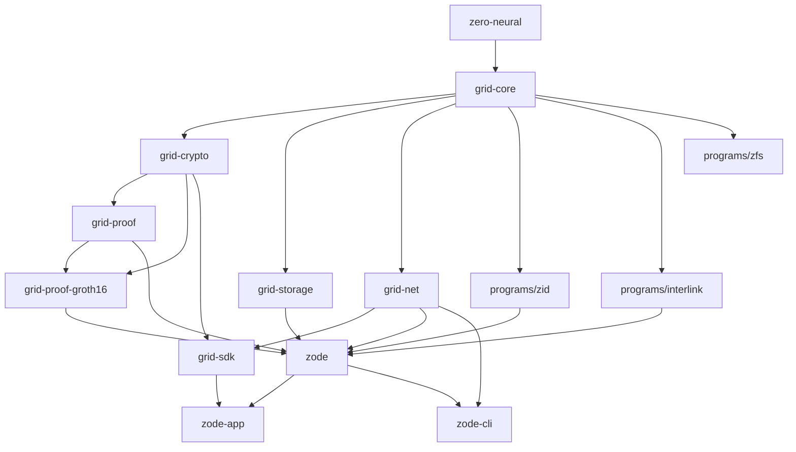

# Zode

A decentralized storage network powered by zero-knowledge proofs and post-quantum encryption.

## Overview

The Zode is a peer-to-peer storage node that receives, validates, and serves
encrypted data sectors over a libp2p network. Sectors are organized by
**programs** -- application-level topics such as identity (ZID) and messaging
(Interlink). Each sector is encrypted client-side, propagated via GossipSub,
and persisted locally in RocksDB. Groth16 proofs let nodes verify that a sector
is correctly shaped and encrypted without ever seeing the plaintext.

Two frontends ship in this workspace:

- **zode-app** -- a standalone desktop GUI built with eframe / egui.
- **zode-cli** -- a console TUI built with ratatui / crossterm.

For the full wire format, cryptographic constructions, and behavioral rules, see the
[Grid Protocol Specification](docs/grid-protocol.md).

## Principles

### Agency

Users own their identity and data. The `zero-neural` crate generates identity
key material entirely on the local device using Shamir secret sharing
(`shamir-vault`). Shares are split across the user's own machines; no share
ever leaves their control. The `grid-sdk` APIs `generate_identity` and
`sign_with_shares` ensure that all signing happens client-side with no remote
key custodian. There is no account creation flow and no server -- the user's
key material **is** their account.

### Privacy

Data is encrypted before it leaves the client. `grid-crypto` applies Poseidon
sponge encryption at the sector level over the BN254 scalar field, then wraps
the per-sector symmetric key in a hybrid envelope (ChaCha20-Poly1305 + HKDF).
Zode storage nodes only ever see opaque ciphertext; they cannot read sector
contents. The `grid-proof-groth16` crate provides a Groth16 circuit that proves
a sector is validly shaped and encrypted without revealing the plaintext,
allowing the network to reject malformed data while preserving confidentiality.

### Decentralization

There is no central server or coordinator. `grid-net` runs a fully
peer-to-peer libp2p stack over QUIC transport. Sectors propagate through
GossipSub topics, direct sector exchanges happen over a request-response
protocol, and peers discover each other through an optional Kademlia DHT. Every
Zode node is equal; any node can join or leave the network without permission.

### Post-Quantum Encryption

Cryptographic primitives are chosen to resist quantum attacks. `zero-neural`
implements a PQ-hybrid scheme that pairs classical Ed25519 signing with
ML-DSA-65 (FIPS 204) and classical X25519 key agreement with ML-KEM-768
(FIPS 203). Sector-level encryption uses the Poseidon hash over the BN254
field (`ark-bn254`), producing ZK-friendly ciphertext that can be verified
inside Groth16 circuits without conversion overhead.

### Open Source

The entire stack is MIT-licensed and published as a Rust workspace of
composable crates. Every layer -- crypto, storage, networking, proofs, SDK, and
UI -- is auditable and independently reusable. All crates enforce
`#![forbid(unsafe_code)]`.

## Architecture



| Crate | Description |
|---|---|
| `zero-neural` | PQ-hybrid key generation, HKDF derivation, Ed25519 + ML-DSA-65 signing, ML-KEM-768 encapsulation |
| `grid-core` | Shared types, canonical CBOR serialization, and protocol messages |
| `grid-crypto` | Client-side encryption: Poseidon sponge sector encryption and hybrid key wrapping |
| `grid-storage` | Storage abstraction over RocksDB with BlockStore, HeadStore, and ProgramIndex |
| `grid-proof` | Pluggable Valid-Sector proof verification trait |
| `grid-proof-groth16` | Groth16 shape+encrypt circuit, prover, verifier, and trusted setup |
| `grid-net` | libp2p network abstraction: QUIC transport, GossipSub topics, request-response protocol, Kademlia DHT |
| `grid-sdk` | Client SDK: identity, encrypt, sign, upload, fetch |
| `zode` | Core node logic tying together storage, network, proof, and programs |
| `programs/zid` | ZID (Zero Identity) program descriptor and messages |
| `programs/interlink` | Interlink (chat) program descriptor and messages |
| `programs/zfs` | ZFS file-system program (placeholder) |
| `zode-app` | Standalone desktop GUI for the Zode |
| `zode-cli` | Console TUI for the Zode |

## Prerequisites

### All platforms

- **Rust** stable toolchain (edition 2021). Install via [rustup](https://rustup.rs/).
- **C/C++ compiler** -- required by the `rocksdb` crate which builds RocksDB from source.
- **CMake** -- required on some platforms for the RocksDB build.

### Windows

- [Visual Studio Build Tools](https://visualstudio.microsoft.com/visual-cpp-build-tools/) with the **Desktop development with C++** workload (provides MSVC, CMake, and the Windows SDK).

### macOS

- Xcode Command Line Tools:

```sh
xcode-select --install
```

### Linux

- GCC/G++ (or Clang), CMake, and GUI libraries for eframe:

```sh
# Debian / Ubuntu
sudo apt install build-essential cmake libxcb-render0-dev libxcb-shape0-dev \
  libxcb-xfixes0-dev libxkbcommon-dev libgtk-3-dev
```

## Running Locally

Clone the repository and build the entire workspace:

```sh
git clone <repo-url> && cd zfs
cargo build
```

### Desktop GUI

```sh
cargo run -p zode-app
```

The GUI opens a settings panel on first launch where you can configure the data
directory, listen address, bootstrap peers, and program subscriptions before
starting the node.

### Console TUI

```sh
cargo run -p zode-cli -- --help
```

Key flags:

| Flag | Default | Description |
|---|---|---|
| `--data-dir` | `zode-data` | RocksDB storage directory |
| `--listen` | `/ip4/0.0.0.0/udp/0/quic-v1` | libp2p listen multiaddr |
| `--bootstrap <ADDR>` | *(none)* | Bootstrap peer multiaddr (repeatable) |
| `--enable-kademlia` | off | Enable Kademlia DHT peer discovery |
| `--kademlia-mode` | `server` | `server` for Zodes, `client` for SDK clients |
| `--no-zid` | off | Disable the ZID program |
| `--no-interlink` | off | Disable the Interlink program |

### Logging

Set the `RUST_LOG` environment variable to control log output:

```sh
RUST_LOG=info cargo run -p zode-cli
```

## Building Release Binaries

All release builds use the same command pattern. Run the build **natively** on
each target platform -- there is no cross-compilation configuration.

### Windows (x86\_64-pc-windows-msvc)

```powershell
cargo build --release -p zode-app
```

Binary: `target\release\zode-app.exe`

### macOS (aarch64-apple-darwin / x86\_64-apple-darwin)

```sh
cargo build --release -p zode-app
```

Binary: `target/release/zode-app`

To produce a universal binary that runs on both Apple Silicon and Intel:

```sh
# Build each architecture
rustup target add x86_64-apple-darwin
cargo build --release -p zode-app --target aarch64-apple-darwin
cargo build --release -p zode-app --target x86_64-apple-darwin

# Combine with lipo
lipo -create \
  target/aarch64-apple-darwin/release/zode-app \
  target/x86_64-apple-darwin/release/zode-app \
  -output zode-app-universal
```

### Linux (x86\_64-unknown-linux-gnu)

Install the prerequisite system packages listed above, then:

```sh
cargo build --release -p zode-app
```

Binary: `target/release/zode-app`

## Running Tests

```sh
cargo test --workspace
```

## Project Structure

```
zfs/
  Cargo.toml              # workspace root
  crates/
    zero-neural/          # PQ-hybrid key generation and signing
    grid-core/            # shared types, CBOR, protocol messages
    grid-crypto/          # Poseidon encryption, hybrid key wrapping
    grid-storage/         # RocksDB storage backend
    grid-proof/           # proof verification trait
    grid-proof-groth16/   # Groth16 ZK circuit and prover
    grid-net/             # libp2p networking layer
    grid-sdk/             # client SDK
    zode/                 # core node logic
    zode-app/             # desktop GUI (eframe/egui)
    zode-cli/             # console TUI (ratatui/crossterm)
    programs/
      zid/                # Zero Identity program
      interlink/          # chat program
      zfs/                # file-system program (placeholder)
```

## Configuration

### ZodeConfig

The `ZodeConfig` struct (in `crates/zode/src/config.rs`) controls node behavior:

| Field | Type | Default | Description |
|---|---|---|---|
| `storage` | `StorageConfig` | `zode-data`, LZ4 compression, 512 open files | RocksDB path and tuning |
| `default_programs` | `DefaultProgramsConfig` | ZID + Interlink enabled | Toggle built-in programs |
| `topics` | `HashSet<ProgramId>` | empty | Additional program topics to subscribe to |
| `sector_limits` | `SectorLimitsConfig` | 256 KB max slot, unlimited per-program | Sector size constraints |
| `sector_filter` | `SectorFilter` | `All` | Per-sector accept filter |
| `network` | `NetworkConfig` | QUIC on `0.0.0.0:0`, Kademlia server mode | libp2p transport and discovery |

### Environment Variables

| Variable | Description |
|---|---|
| `RUST_LOG` | Controls tracing verbosity (e.g. `info`, `debug`, `warn`, `zode=debug,grid_net=trace`) |

## License

MIT
