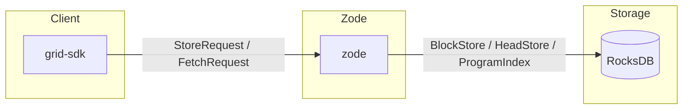

# The Grid v0.1.0 — Overview

## System definition

**The Grid** is a peer-to-peer encrypted datastore. It is **not** a blockchain and has no tokens or consensus layer. Clients store and retrieve content-addressed sectors through **Zodes** (storage nodes); data is encrypted by the client before upload, and Zodes only ever see ciphertext.

## Core properties

| Property | Description |
|----------|-------------|
| **Encrypted-by-default** | All sector payloads are ciphertext at rest; clients encrypt before upload. Zodes never see plaintext. Sharing is supported by deriving or distributing keys so multiple participants can encrypt/decrypt the same sector (see [10-crypto](10-crypto.md)). |
| **Program-scoped storage** | Storage and subscriptions are scoped by **program** (e.g. ZID, Interlink). Zodes subscribe to program topics and serve only for those programs. |
| **Optional ZK proofs** | Programs may require Valid-Sector proofs; verification is pluggable and per-program. |
| **Client-driven replication** | Clients choose replication factor R and upload to R Zodes; replication is not consensus-based. |
| **Rust implementation** | Implemented in Rust (stable), with RocksDB as the mandatory storage engine. |

## Success criteria (requirements §10)

- Clients can connect to Zodes, encrypt sectors, and upload with configurable replication.
- Zodes persist blocks and heads in RocksDB, verify proofs when required, and enforce local storage policy.
- Console CLI (zode-cli) and standalone app (zode-app) can run a Zode and show status, programs, peers, and live log.
- SDK supports connect, program_id/topic, encrypt, prove (optional), upload, fetch, and head helpers; ZID and Interlink helpers are available.
- No RocksDB usage outside `grid-storage`; no direct libp2p outside `grid-net`.

## Context diagram

- **Client** uses the SDK to encrypt, (optionally) prove, and send store/fetch requests to Zodes.
- **Zode** runs libp2p, subscribes to program topics, verifies proofs, and persists via `grid-storage` only.
- **RocksDB** is used exclusively by `grid-storage`; no other crate touches it.

## Document index

| Doc | Purpose |
|-----|---------|
| [01-architecture](01-architecture.md) | Crate layout, dependencies, tooling. |
| [02-storage](02-storage.md) | RocksDB abstraction, schemas, config. |
| [03-programs-and-topics](03-programs-and-topics.md) | Program identity, topic naming. |
| [04-proof](04-proof.md) | Valid-Sector proof verification. |
| [05-standard-programs](05-standard-programs.md) | ZID and Interlink. |
| [06-zode](06-zode.md) | Zode node requirements. |
| [07-zode-cli](07-zode-cli.md) | Console-only Zode CLI. |
| [08-zode-app](08-zode-app.md) | Standalone Zode application. |
| [09-sdk](09-sdk.md) | Client SDK. |
| [10-crypto](10-crypto.md) | Client-side encryption. |
| [11-core-types](11-core-types.md) | Shared types and identifiers. |
| [12-protocol](12-protocol.md) | v1 protocol, wire format, discovery. |
| [13-mailbox-protocol](13-mailbox-protocol.md) | Metadata-private mailbox protocol. |
| [14-dht-discovery](14-dht-discovery.md) | Kademlia DHT peer discovery. |
| [15-network-visualization](15-network-visualization.md) | GPU-accelerated network graph in Zode app. |
