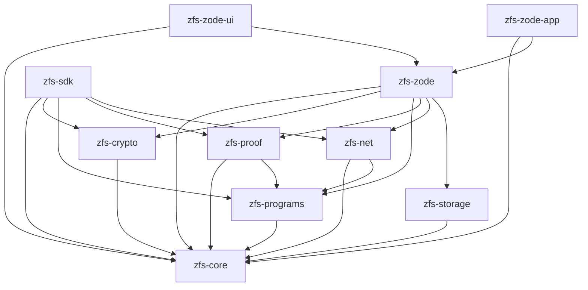

# ZFS v0.1.0 — Architecture

## Purpose

This document defines the language, crate-per-layer layout, API and tooling rules, and dependency boundaries for ZFS v0.1.0.

## Language and tooling

- **Language:** Rust (stable). Idiomatic style; `clippy` and `rustfmt` on CI.
- **Errors:** `Result<T, E>`-based; minimal `unsafe`; shared error types where appropriate (see [11-core-types](11-core-types.md)).
- **Versioning:** Semantic versioning; minimal, stable public APIs per crate.

## Crate list and dependency graph

| Crate | Path | Purpose | ZFS deps |
|-------|------|---------|----------|
| zfs-core | `crates/zfs-core` | Shared types, identifiers, serialization, hashing | (none) |
| zfs-crypto | `crates/zfs-crypto` | Client-side encryption; ciphertext-at-rest | zfs-core |
| zfs-storage | `crates/zfs-storage` | RocksDB abstraction; only crate that touches RocksDB | zfs-core |
| zfs-programs | `crates/zfs-programs` | Program identity, topic naming, descriptors | zfs-core |
| zfs-proof | `crates/zfs-proof` | Valid-Sector proof verification; pluggable | zfs-core, zfs-programs |
| zfs-net | `crates/zfs-net` | Network abstraction over libp2p (QUIC, GossipSub) | zfs-core, zfs-programs |
| zfs-zode | `crates/zfs-zode` | Zode node: libp2p, storage, proof, policy, metrics | zfs-core, zfs-crypto, zfs-programs, zfs-proof, zfs-net, zfs-storage |
| zfs-zode-ui | `crates/zfs-zode-ui` | Console-only Zode: CLI/TUI | zfs-core, zfs-zode |
| zfs-zode-app | `crates/zfs-zode-app` | Standalone Zode application (desktop/tray) | zfs-core, zfs-zode |
| zfs-sdk | `crates/zfs-sdk` | Client SDK: connect, encrypt, prove, upload, fetch, heads | zfs-core, zfs-crypto, zfs-programs, zfs-proof, zfs-net |

**Build order:**  
`zfs-core` → `zfs-crypto`, `zfs-storage`, `zfs-programs` → `zfs-proof`, `zfs-net` → `zfs-zode`, `zfs-sdk` → `zfs-zode-ui`, `zfs-zode-app`.

## Crate dependency diagram (Mermaid)



## Crate boundaries (rules)

- **RocksDB:** No RocksDB outside `zfs-storage`. All block/head/index persistence goes through `zfs-storage` APIs.
- **libp2p:** No direct libp2p outside `zfs-net`. Zode and SDK use `zfs-net` for discovery, connect, send/receive, and topic subscription.
- **Public APIs:** Each crate exposes a minimal, stable public API; internal modules may change without semver bump for non-public items.

## Workspace layout

- **Root:** Single Cargo workspace at repo root.
- **Members:** All ZFS crates under `crates/`, e.g. `crates/zfs-core`, `crates/zfs-crypto`, …
- **Binaries:** Only crates that are runnable have `[[bin]]`:
  - `zfs-zode-ui`: binary for console-only Zode (e.g. `zode` or `zode-ui`).
  - `zfs-zode-app`: binary for standalone Zode application (desktop or system-tray).

Example root `Cargo.toml`:

```toml
[workspace]
resolver = "2"
members = [
  "crates/zfs-core",
  "crates/zfs-crypto",
  "crates/zfs-storage",
  "crates/zfs-programs",
  "crates/zfs-proof",
  "crates/zfs-net",
  "crates/zfs-zode",
  "crates/zfs-zode-ui",
  "crates/zfs-zode-app",
  "crates/zfs-sdk",
]
```

Each crate `Cargo.toml` declares `[lib]`; only `zfs-zode-ui` and `zfs-zode-app` add `[[bin]]` with the desired binary name.

## Implementation

- Create the workspace and crate directories as above.
- Add dependencies between crates via `path = ".."` and minimal external deps.
- Run `cargo build --workspace` and `cargo clippy --workspace` to validate the graph.
