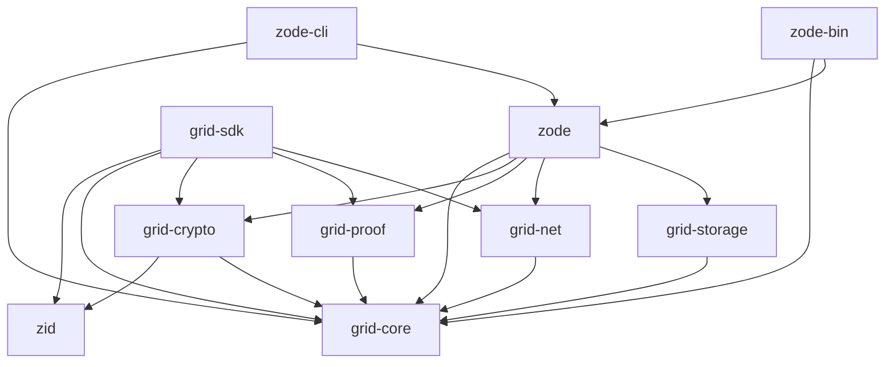

# The Grid v0.1.0 — Architecture

## Purpose

This document defines the language, crate-per-layer layout, API and tooling rules, and dependency boundaries for the Grid v0.1.0.

## Language and tooling

- **Language:** Rust (stable). Idiomatic style; `clippy` and `rustfmt` on CI.
- **Errors:** `Result<T, E>`-based; minimal `unsafe`; shared error types where appropriate (see [11-core-types](11-core-types.md)).
- **Versioning:** Semantic versioning; minimal, stable public APIs per crate.

## Crate list and dependency graph

| Crate | Path | Purpose | Grid deps |
|-------|------|---------|----------|
| zid | `crates/zid` | PQ-Hybrid key generation, HKDF derivation, Ed25519 + ML-DSA-65 signing, ML-KEM-768 encapsulation, DID:key encoding/decoding (zero-id compatible) | (none) |
| grid-core | `crates/grid-core` | Shared types, identifiers, serialization, hashing | (none) |
| grid-crypto | `crates/grid-crypto` | Client-side encryption; ciphertext-at-rest; SectorKey wrapping | zid, grid-core |
| grid-storage | `crates/grid-storage` | RocksDB abstraction; only crate that touches RocksDB | grid-core |
| programs-zid | `crates/programs-zid` | ZID program identity, descriptors | grid-core |
| programs-interlink | `crates/programs-interlink` | Interlink program identity, descriptors | grid-core |
| programs-zfs | `crates/programs-zfs` | ZFS (file system) program | grid-core |
| grid-proof | `crates/grid-proof` | Valid-Sector proof verification; pluggable | grid-core |
| grid-proof-groth16 | `crates/grid-proof-groth16` | Groth16 proof backend | grid-core, grid-proof |
| grid-net | `crates/grid-net` | Network abstraction over libp2p (QUIC, GossipSub) | grid-core |
| zode | `crates/zode` | Zode node: libp2p, storage, proof, policy, metrics | grid-core, grid-crypto, grid-proof, grid-net, grid-storage |
| zode-cli | `crates/zode-cli` | Console-only Zode: CLI/TUI | grid-core, zode |
| zode-bin | `crates/zode-bin` | Standalone Zode application (desktop/tray) | grid-core, zode |
| grid-sdk | `crates/grid-sdk` | Client SDK: connect, encrypt, prove, upload, fetch, heads; identity + signing | zid, grid-core, grid-crypto, grid-proof, grid-net |

**Build order:**
`zid` (standalone) → `grid-core` → `grid-crypto`, `grid-storage`, `programs-zid`, `programs-interlink`, `programs-zfs` → `grid-proof`, `grid-net` → `zode`, `grid-sdk` → `zode-cli`, `zode-bin`.

## Crate dependency diagram (Mermaid)



## Crate boundaries (rules)

- **zid:** No Grid dependencies. Shared with zid and any other project needing the PQ-Hybrid key hierarchy. Public API: `NeuralKey`, `IdentitySigningKey`, `IdentityVerifyingKey`, `MachineKeyPair`, `MachinePublicKey`, `MachineKeyCapabilities`, `HybridSignature`, `SharedSecret`, `EncapBundle`, `CryptoError`; top-level functions `derive_identity_signing_key`, `derive_machine_keypair`, `ed25519_to_did_key`, `did_key_to_ed25519`. `grid-crypto` and `grid-sdk` depend on it; Zodes verify signatures using `MachinePublicKey::verify()` re-exported through `grid-crypto`.
- **RocksDB:** No RocksDB outside `grid-storage`. All block/head/index persistence goes through `grid-storage` APIs.
- **libp2p:** No direct libp2p outside `grid-net`. Zode and SDK use `grid-net` for discovery, connect, send/receive, and topic subscription.
- **Public APIs:** Each crate exposes a minimal, stable public API; internal modules may change without semver bump for non-public items.

## Workspace layout

- **Root:** Single Cargo workspace at repo root.
- **Members:** All Grid crates under `crates/`, e.g. `crates/zid`, `crates/grid-core`, `crates/grid-crypto`, …
- **Binaries:** Only crates that are runnable have `[[bin]]`:
  - `zode-cli`: binary for console-only Zode (e.g. `zode` or `zode-cli`).
  - `zode-bin`: binary for standalone Zode application (desktop or system-tray).

Example root `Cargo.toml`:

```toml
[workspace]
resolver = "2"
members = [
  "crates/zid",
  "crates/grid-core",
  "crates/grid-crypto",
  "crates/grid-storage",
  "crates/programs-zid",
  "crates/programs-interlink",
  "crates/programs-zfs",
  "crates/grid-proof",
  "crates/grid-proof-groth16",
  "crates/grid-net",
  "crates/zode",
  "crates/zode-cli",
  "crates/zode-bin",
  "crates/grid-sdk",
]
```

Each crate `Cargo.toml` declares `[lib]`; only `zode-cli` and `zode-bin` add `[[bin]]` with the desired binary name.

## Implementation

- Create the workspace and crate directories as above.
- Add dependencies between crates via `path = ".."` and minimal external deps.
- Run `cargo build --workspace` and `cargo clippy --workspace` to validate the graph.
