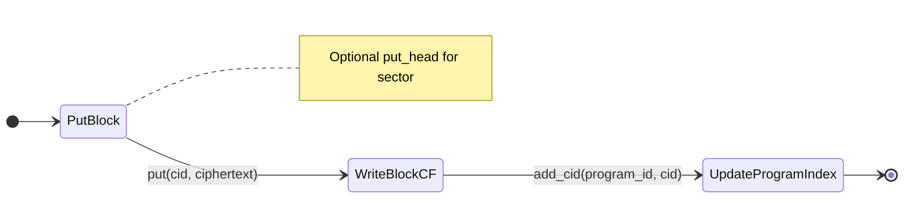

# ZFS v0.1.0 — Storage

## Purpose

RocksDB is the **mandatory** storage engine for ZFS v0.1.0. All access to RocksDB is abstracted behind the `zfs-storage` crate; no other crate may use RocksDB directly. This document defines the abstraction, key/value schemas, config, and isolation (namespaces, column families).

## Storage engine

- **Engine:** RocksDB only.
- **Abstraction:** `zfs-storage` exposes traits/types (`StorageBackend`, `BlockStore`, `HeadStore`, `ProgramIndex`); implementation uses RocksDB internally.
- **Rule:** No RocksDB dependency or raw DB access outside `zfs-storage`.

## Four responsibilities and key/value schemas

### 1. Block store

- **Key:** `Cid` (32 bytes). Use a fixed prefix for the block CF so keys are namespaced.
- **Value:** Ciphertext bytes (opaque to storage).
- **Semantics:** One key-value per content-addressed block.

**Key layout:** `PREFIX_BLOCK || cid.as_bytes()` (e.g. `"b/"` or single-byte prefix + 32 bytes).

### 2. Sector head store

- **Key:** `SectorId` (canonical bytes; see [11-core-types](11-core-types.md)). Use a fixed prefix.
- **Value:** Serialized `Head` (canonical CBOR per 11-core-types).
- **Semantics:** Current head (latest version) per sector.

**Key layout:** `PREFIX_HEAD || sector_id_canonical_bytes`.

### 3. Program index

- **Key:** `ProgramId` (32 bytes). Use a fixed prefix.
- **Value:** Set or list of CIDs (e.g. CBOR array of Cid bytes, or dedicated encoding). Used to enumerate CIDs per program.
- **Semantics:** Index from program to CIDs stored for that program.

**Key layout:** `PREFIX_PROGRAM || program_id.as_bytes()`.

### 4. Peer metadata (optional)

- **Key:** `PeerId` (or equivalent bytes). Use a fixed prefix.
- **Value:** Connection metadata / stats (e.g. last seen, bytes in/out). Format implementation-defined.
- **Semantics:** Optional; not required for core store/serve. Use metadata column family if present.

**Key layout:** `PREFIX_PEER || peer_id_bytes`.

## RocksDB configuration

- **WAL:** Enabled; durability as per RocksDB defaults.
- **Compression:** Configurable; support at least LZ4 or ZSTD for block/head CFs.
- **Compaction:** Standard compaction; configurable style (e.g. leveled).
- **File handles:** Bounded; configurable limit to avoid exhausting FDs.
- **Path and size:** Configurable DB path and optional max DB size (for policy; see [06-zode](06-zode.md)).

Config struct (conceptual): `path`, `max_open_files`, `compression` (enum), `max_db_size_bytes` (optional), etc.

## Isolation

- **Namespace prefixes:** All keys use a byte prefix (e.g. `PREFIX_BLOCK`, `PREFIX_HEAD`, `PREFIX_PROGRAM`, `PREFIX_PEER`) so different subsystems do not collide.
- **Column families:** Open or create CFs for:
  - **blocks** — block store.
  - **heads** — sector head store.
  - **program_index** — program index.
  - **metadata** — peer metadata (optional).

Peer metadata uses the metadata CF when present.

## Interfaces (Rust-like)

```rust
pub trait BlockStore {
    fn put(&self, cid: &Cid, ciphertext: &[u8]) -> Result<(), StorageError>;
    fn get(&self, cid: &Cid) -> Result<Option<Vec<u8>>, StorageError>;
    fn delete(&self, cid: &Cid) -> Result<(), StorageError>;
}

pub trait HeadStore {
    fn put_head(&self, sector_id: &SectorId, head: &Head) -> Result<(), StorageError>;
    fn get_head(&self, sector_id: &SectorId) -> Result<Option<Head>, StorageError>;
}

pub trait ProgramIndex {
    fn add_cid(&self, program_id: &ProgramId, cid: &Cid) -> Result<(), StorageError>;
    fn list_cids(&self, program_id: &ProgramId) -> Result<Vec<Cid>, StorageError>;
    fn remove_cid(&self, program_id: &ProgramId, cid: &Cid) -> Result<(), StorageError>;
}

pub trait StorageBackend: BlockStore + HeadStore + ProgramIndex {
    fn stats(&self) -> Result<StorageStats, StorageError>;
}

pub struct StorageConfig {
    pub path: PathBuf,
    pub max_open_files: Option<i32>,
    pub compression: CompressionType,
    pub max_db_size_bytes: Option<u64>,
}
```

- **StorageError:** Wraps RocksDB errors; may include `ZfsError::StorageFull` when at capacity (see [11-core-types](11-core-types.md)).
- **StorageStats:** For UI and policy; e.g. total size, key count per CF (implementation-defined).

## State machine (write flow)



## Implementation

- **Key byte layout:** Define constants for `PREFIX_*`; concatenate with ID bytes; document in crate.
- **CF open/creation:** Open existing CFs or create if missing on first open.
- **Config:** Load from `StorageConfig`; pass from Zode config (see [06-zode](06-zode.md)).
- **Errors:** Use `StorageError` and map to `ZfsError` where appropriate for Zode/SDK.
