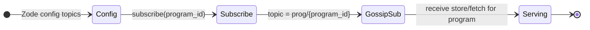

# The Grid v0.1.0 — Programs and topics

## Purpose

Program identity and topic naming define how storage and subscriptions are scoped. Zodes subscribe to one or more **program topics** and serve store/fetch only for those programs. This document defines `ProgramDescriptor`, `program_id`, and `topic` format.

## Program identity

- **program_id:** `program_id = HASH(canonical(ProgramDescriptor))`.
- **Hash:** SHA-256 (same as Cid). Output 32 bytes; hex-encoded in APIs where needed.
- **Canonical encoding:** CBOR (deterministic) per [11-core-types](11-core-types.md). The bytes passed to the hash are the canonical serialization of `ProgramDescriptor`.

## Topic naming

- **Topic string:** `topic = "prog/" + program_id_hex` (or `"prog/" + base64url(program_id)` if preferred; spec uses hex for consistency with core types).
- **Usage:** GossipSub (and any pub/sub) uses this topic so that Zodes subscribe by program. Store/fetch messages are scoped to the program; see [12-protocol](12-protocol.md).

## Zode subscription model

- Zodes **subscribe** to one or more program topics (configured list of `program_id`s or topic strings).
- Only store/fetch for **subscribed** programs are accepted (policy; see [06-zode](06-zode.md)).
- Program-scoped storage: blocks and heads are indexed by `program_id`; the program index in [02-storage](02-storage.md) keys by `ProgramId`.

## Interfaces

### ProgramDescriptor (base)

Defined in [11-core-types](11-core-types.md) as the base type. Here we define the **canonical encoding** and derivation:

```rust
pub struct ProgramDescriptor {
    // Program-specific fields; e.g. name, version, proof_required, ...
    // Exact fields in 05-standard-programs for ZID and Interlink.
}

impl ProgramDescriptor {
    pub fn program_id(&self) -> ProgramId {
        let canonical = self.encode_canonical().expect("canonical encode");
        ProgramId::from_hash(&canonical)
    }

    pub fn topic(&self) -> String {
        format!("prog/{}", self.program_id().to_hex())
    }

    pub fn encode_canonical(&self) -> Result<Vec<u8>, EncodeError>;
    pub fn decode_canonical(bytes: &[u8]) -> Result<Self, DecodeError>;
}
```

- **program_id():** Returns `ProgramId` = SHA-256(canonical(descriptor)).
- **topic():** Returns the topic string `"prog/" + program_id.to_hex()`.

### Topic string format

- **Format:** `prog/<program_id_hex>`.
- **program_id_hex:** 64 lowercase hex characters (32 bytes).

## Diagram (subscription lifecycle)



## Implementation

- **Crate:** `programs-zid`, `programs-interlink`, `programs-zfs` (and/or types in `grid-core`). Canonical encoding and hashing in program crates or shared in core.
- **Hashing:** SHA-256; same as Cid derivation in 11-core-types.
- **Topic naming:** Implemented in program crates and used by `grid-net`, `zode`, and `grid-sdk`. No spaces in topic strings; use a single canonical format (hex) across the system.
