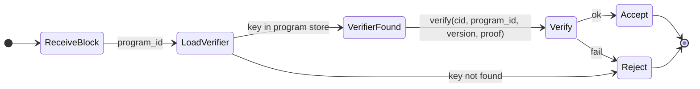

# ZFS v0.1.0 — Proof (Valid-Sector verification)

## Purpose

The `zfs-proof` crate provides **pluggable** Valid-Sector proof verification. Programs may require that stored sectors are accompanied by a proof that the sector is valid for that program. Verification is bound to `cid`, `program_id`, and `version`; verifier keys are loaded from a local program store. No concrete ZK system is mandated—only the trait and integration points.

## Requirements

- **Load verifier keys** from a local program store (see [Verifier key storage](#verifier-key-storage)).
- **Verify** proofs bound to `(cid, program_id, version, proof_bytes)`.
- **Pluggable:** Trait-based; implementations may use different proof systems.

## Interfaces

### ProofVerifier trait

```rust
pub trait ProofVerifier: Send + Sync {
    fn verify(
        &self,
        cid: &Cid,
        program_id: &ProgramId,
        version: u64,
        proof: &[u8],
        payload_context: Option<&[u8]>,
    ) -> Result<VerifiedSector, ProofError>;
}
```

- **payload_context:** Optional extra context (e.g. ciphertext hash or commitment) if the proof system requires it. Opaque to the trait.
- **VerifiedSector:** Marker or struct indicating successful verification (e.g. `VerifiedSector { cid, program_id, version }`). Used by Zode to accept the block.

### Verifier key loading

- **API:** Verifier keys are loaded by the implementation (or a separate loader) from a **local program store**.
- **Store location:** Implementation-defined. Options:
  - **Filesystem path:** e.g. `{config_dir}/programs/{program_id}/verifier_key` or similar.
  - **RocksDB:** Not in `zfs-storage` by default; if used, could be a separate CF or a small key-value store in the Zode process.
  - **Program index / descriptor:** Verifier key may be embedded or referenced in program metadata fetched at runtime.

This spec **does not** mandate one option. The `zfs-proof` crate must document how verifier keys are loaded (e.g. `ProofVerifier::load_verifier(program_id, path_or_config) -> impl ProofVerifier`). Zode config (see [06-zode](06-zode.md)) may pass a base path or config for the proof layer.

### Errors

- **ProofError:** e.g. `VerifierKeyNotFound`, `VerificationFailed`, `InvalidProofFormat`. Map to `ZfsError::ProofInvalid` for Zode/SDK.

## State machine (receive block + proof)



## Implementation

- **Crate:** `zfs-proof`. Deps: `zfs-core`, `zfs-programs`.
- **No concrete ZK:** Only the trait and error types; integration point with Zode (call verify before persisting) and SDK (optional prove before upload).
- **Verifier key storage:** Document in crate and in [06-zode](06-zode.md) how Zode supplies the program store path or config to the proof layer.
- **When proofs are required:** Per-program (e.g. flag in `ProgramDescriptor` or config). Zode rejects store if proof required but missing or invalid.
