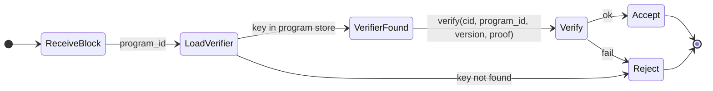

# The Grid v0.1.0 — Proof (Valid-Sector verification)

## Purpose

The `grid-proof` crate provides **pluggable** Valid-Sector proof verification. Programs may require that stored sectors are accompanied by a proof that the sector is valid for that program. Verification is bound to `cid`, `program_id`, and `version`; verifier keys are loaded from a local program store. No concrete ZK system is mandated—only the trait and integration points.

## Proof semantics (encryption and correct structure)

- **Zodes only see ciphertext.** Per [10-crypto](10-crypto.md), sector payloads are encrypted by the client before upload; Zodes never see plaintext.
- **Proofs attest to the actual program-specific fields, not just metadata.** Each program defines its own **content schema** (the real data fields: e.g. ZID identity fields vs Interlink sender/content/timestamp). A Valid-Sector proof is computed by the **client** over the **plaintext** (or a commitment to it)—i.e. over those program-specific fields—and proves that the hidden plaintext has the **correct fields and structure for that program**, without revealing the plaintext. So the Zode learns “this ciphertext decrypts to a valid ZidMessage” or “to a valid ZChatMessage”, etc., depending on `program_id`; it does **not** learn the actual field values. Metadata (`cid`, `program_id`, `version`) is public and bound to the proof; what is proven in zero-knowledge is the **content** (the program’s actual field layout and validity).
- **Per-program validity.** Validity rules and field schemas differ per program (see [05-standard-programs](05-standard-programs.md)). Verifier keys and proof logic are **per program** because the actual fields being proven are different for each program.
- **Verification without plaintext.** The Zode verifies using only: `(cid, program_id, version, proof_bytes)` and optional `payload_context`. The verifier does **not** need the plaintext or the decryption key; it only needs the right verifier key for that `program_id`, so it can check that the hidden content conforms to that program’s schema.
- **Binding.** The proof is bound to `cid` (hash of the ciphertext the Zode stores), so the Zode can confirm the proof applies to the exact payload it received.

## Requirements

- **Load verifier keys** from a local program store (see [Verifier key storage](#verifier-key-storage)).
- **Verify** proofs bound to `(cid, program_id, version, proof_bytes)`.
- **Pluggable:** Trait-based; implementations may use different proof systems.

## Interfaces

### ProofVerifier trait

```rust
pub trait ProofVerifier: Send + Sync {
    fn verify(
        &self,
        cid: &Cid,
        program_id: &ProgramId,
        version: u64,
        proof: &[u8],
        payload_context: Option<&[u8]>,
    ) -> Result<VerifiedSector, ProofError>;
}
```

- **payload_context:** Optional extra context (e.g. ciphertext hash or a public commitment to the plaintext) if the proof system requires it. Used to bind verification to the stored payload without revealing plaintext. Opaque to the trait.
- **VerifiedSector:** Marker or struct indicating successful verification (e.g. `VerifiedSector { cid, program_id, version }`). Used by Zode to accept the block. Successful verification means the Zode can treat the sector as valid for **that program’s actual fields** (e.g. valid ZidMessage or ZChatMessage schema) even though it only ever saw ciphertext and never the plaintext field values.

### Verifier key loading

- **API:** Verifier keys are loaded by the implementation (or a separate loader) from a **local program store**.
- **Store location:** Implementation-defined. Options:
  - **Filesystem path:** e.g. `{config_dir}/programs/{program_id}/verifier_key` or similar.
  - **RocksDB:** Not in `grid-storage` by default; if used, could be a separate CF or a small key-value store in the Zode process.
  - **Program index / descriptor:** Verifier key may be embedded or referenced in program metadata fetched at runtime.

This spec **does not** mandate one option. The `grid-proof` crate must document how verifier keys are loaded (e.g. `ProofVerifier::load_verifier(program_id, path_or_config) -> impl ProofVerifier`). Zode config (see [06-zode](06-zode.md)) may pass a base path or config for the proof layer.

### Errors

- **ProofError:** e.g. `VerifierKeyNotFound`, `VerificationFailed`, `InvalidProofFormat`. Map to `GridError::ProofInvalid` for Zode/SDK.

## State machine (receive block + proof)



## Implementation

- **Crate:** `grid-proof`. Deps: `grid-core`, program crates.
- **No concrete ZK:** Only the trait and error types; integration point with Zode (call verify before persisting) and SDK (optional prove before upload).
- **Verifier key storage:** Document in crate and in [06-zode](06-zode.md) how Zode supplies the program store path or config to the proof layer.
- **When proofs are required:** Per-program (e.g. flag in `ProgramDescriptor` or config). Zode rejects store if proof required but missing or invalid.
