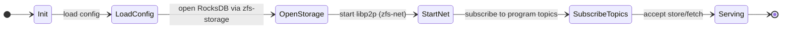
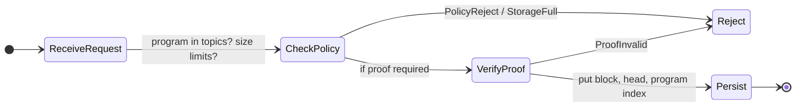

# ZFS v0.1.0 — Zode (node)

## Purpose

The Zode is the storage node: it runs libp2p + QUIC, uses GossipSub for topic subscription, persists blocks and heads in RocksDB via `zfs-storage`, verifies proofs when required, enforces local storage policy, and exposes metrics/state for the UI. This document defines requirements, config, storage policy, and integration with proof and verifier key storage.

## Requirements (must)

- **Run libp2p + QUIC:** Transport and discovery via `zfs-net`; no direct libp2p outside `zfs-net`.
- **Use GossipSub:** Subscribe to configured program topics (`prog/{program_id}`).
- **Subscribe to configured program topics:** Only accept store/fetch for subscribed programs (policy).
- **Persist in RocksDB:** All persistence via `zfs-storage` only (BlockStore, HeadStore, ProgramIndex). No direct RocksDB.
- **Verify proofs when required:** Before persisting a block, if the program requires proof, call `ProofVerifier::verify`; reject with `ProofInvalid` on failure (see [04-proof](04-proof.md), [11-core-types](11-core-types.md)).
- **Enforce local storage policy:** See [Storage policy](#storage-policy).
- **Expose metrics/state to UI:** Counters and gauges (e.g. blocks stored, peer count, storage usage) for [07-zode-ui](07-zode-ui.md) and [08-zode-app](08-zode-app.md).

## Config schema

Full Zode config (single place for node behavior):

| Field | Type | Description |
|-------|------|-------------|
| **storage** | StorageConfig | Path, max_open_files, compression, max_db_size_bytes (see [02-storage](02-storage.md)). |
| **topics** | Vec<ProgramId> or Vec<String> | Program topics to subscribe to. |
| **limits** | LimitsConfig | Max size per program, max total DB size (for policy). |
| **proof_policy** | ProofPolicyConfig | When to require proof; path or config for verifier key store (see [04-proof](04-proof.md)). |
| **network** | NetworkConfig | Listen address, bootstrap_peers, etc. |

**Storage config:** Same as [02-storage](02-storage.md): path, max_open_files, compression, max_db_size_bytes.

**Proof config:** Base path or config for verifier key storage (e.g. `program_store_path` or `verifier_key_path`). Passed to `zfs-proof` for loading verifier keys (see [04-proof](04-proof.md)).

**Format:** Config file (YAML/TOML) and/or env vars; implementation-defined. Document in crate.

## Storage policy

Concrete rules the Zode enforces (reject with `PolicyReject` or `StorageFull` when violated):

| Rule | Description |
|------|-------------|
| **Program allowlist** | Only accept store/fetch for **subscribed** program topics (config `topics`). Reject with `PolicyReject` for other programs. |
| **Max size per program** | Optional cap (bytes or block count) per program_id; reject with `StorageFull` or `PolicyReject` when exceeded. |
| **Max total DB size** | Optional cap (max_db_size_bytes in storage config); reject with `StorageFull` when at capacity. |
| **Eviction** | v0.1.0 does not mandate eviction; if implemented, document (e.g. LRU per program or global). |

Policy is enforced in the Zode request handler **before** or **after** proof verification (e.g. check program allowlist first, then verify proof, then check size limits before persisting).

## Interfaces

- **Zode config:** Struct as above; load from file/env.
- **Hooks:** Storage (via `zfs-storage`), proof (via `ProofVerifier`), policy (check program + limits before/after persist).
- **Metrics surface:** Counters (e.g. `blocks_stored_total`, `store_rejections_total` by reason), gauges (e.g. `peer_count`, `db_size_bytes`). Exposed for UI (see [07-zode-ui](07-zode-ui.md)).

## State machine (lifecycle)

## Request flow (StoreRequest)

## Implementation

- **Crate:** `zfs-zode`. Deps: zfs-core, zfs-crypto, zfs-programs, zfs-proof, zfs-net, zfs-storage.
- **No direct RocksDB:** Call `zfs-storage` only.
- **Config:** Config file and env; document schema in crate and reference [02-storage](02-storage.md) for storage, [04-proof](04-proof.md) for verifier key path.
- **Verifier key storage:** Zode passes config (e.g. `program_store_path`) to proof layer; proof crate loads verifier keys from that location (see [04-proof](04-proof.md)).
