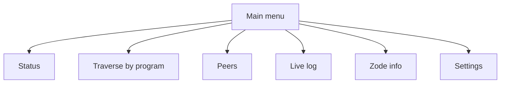

# The Grid v0.1.0 — Zode CLI (console-only)

## Purpose

The **zode-cli** crate provides a **console-only** Zode experience: CLI/TUI for status, datastore traversal, peers, live log, and Zode info. It runs the Zode in console only (e.g. binary `zode` or `zode-cli`). It does **not** touch RocksDB directly—all data comes from the Zode library (shared state, in-process API, or future RPC).

## Requirements

- **Status:** Listening port, peer count, connected peers, topics, storage usage (RocksDB stats from Zode).
- **Traverse by program:** List programs, CIDs per program, head metadata.
- **Connected Zodes:** zode_id, address, connection state.
- **Live data log:** Announce events, StoreRequests, proof results, rejections with reasons.
- **Zode info:** zode_id, node key fingerprint, storage path, total DB size, limits.
- **Settings:** View and toggle default programs (ZID, Interlink) on or off (see [06-zode § Default programs](06-zode.md#default-programs)).

## UI data contracts

These are the data structures the UI **reads** from the Zode (in-process or RPC). Zode exposes these so the UI can render status, traverse, peers, log, and settings.

| Contract | Description |
|----------|-------------|
| **Status** | Listening port, peer_count, connected_peers (list), topics (list), storage_usage (e.g. db_size_bytes, block_count). |
| **Program list** | List of program_id (or topic strings) the Zode subscribes to. |
| **CID list** | Per program_id: list of CIDs (from program index). |
| **Head metadata** | Per sector_id: Head (sector_id, cid, version, program_id, prev_head_cid, timestamp_ms). |
| **Zode list** | zode_id (`Zx`-prefixed), address (multiaddr), connection_state (e.g. connected, dialing). |
| **Log events** | Event types: Announce, StoreRequest (cid, program_id), ProofResult (ok/fail), Rejection (reason, code). |
| **Default programs** | Current enabled/disabled state for each default program (ZID, Interlink). See [06-zode § Default programs](06-zode.md#default-programs). |

## Interfaces (summary)

```rust
// Data contracts (what UI reads from Zode)
pub struct ZodeStatus {
    pub listen_port: u16,
    pub peer_count: usize,
    pub connected_peers: Vec<PeerInfo>,
    pub topics: Vec<String>,
    pub storage_usage: StorageUsage,
}

pub struct PeerInfo {
    pub zode_id: ZodeId,
    pub address: Option<Multiaddr>,
    pub connection_state: ConnectionState,
}

pub struct StorageUsage {
    pub db_size_bytes: u64,
    pub block_count: u64,
    // optional: per-CF stats
}

pub enum LogEvent {
    Announce { program_id: ProgramId },
    StoreRequest { cid: Cid, program_id: ProgramId },
    ProofResult { cid: Cid, ok: bool },
    Rejection { reason: String, code: GridError },
}
```

- **ZodeStatus:** Returned by Zode for status screen.
- **Program list / CID list / Head metadata:** From Zode (via storage abstraction or Zode API); UI does not call RocksDB.
- **Zode list:** From Zode (grid-net); PeerInfo list.
- **Log events:** Stream or poll from Zode; event types as above.

## Diagrams (optional)

### UI state / screen flow



### Settings screen

The **Settings** screen (TUI or CLI subcommand) lets the operator toggle default programs on or off. It reads the current `DefaultProgramsConfig` from the Zode and writes changes back to the config.

**TUI mode:** An interactive screen listing each default program with a toggle (e.g. `[x] ZID`, `[ ] Interlink`).

**CLI subcommand mode:**

```
zode settings                          # show current default-program states
zode settings --enable interlink      # enable Interlink
zode settings --disable zid            # disable ZID
```

Changes are persisted to the Zode config file. A restart (or hot-reload, if supported) applies the new effective topic list.

## Implementation

- **Crate:** `zode-cli`. Deps: grid-core, zode.
- **Binary:** Run Zode in console only (e.g. `zode` or `zode-cli`). Binary links to zode and starts the node; CLI reads from Zode via in-process API (e.g. Zode exposes `status()`, `programs()`, `peers()`, `log_stream()`).
- **Data source:** No direct RocksDB—all data from Zode (shared state or API). How the UI gets data: in-process function calls, or future RPC/socket; document in crate.
- **CLI flags:** e.g. config path, listen address; pass through to Zode config.
