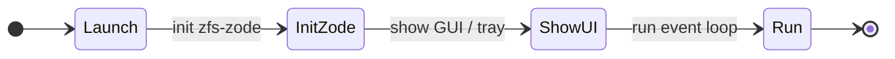

# ZFS v0.1.0 — Zode app (standalone)

## Purpose

The **zfs-zode-app** crate provides a **standalone** Zode application: run the node as its own app (e.g. desktop or system-tray), **not** the console-only binary. It has the same Zode capabilities as the console (persist, verify, policy, metrics) but a different UI surface and packaging.

## Requirements

- **Run Zode as standalone application:** Desktop app or system-tray; separate binary from console-only `zode-ui`.
- **Same Zode capabilities:** Uses `zfs-zode` for libp2p, storage, proof, policy, metrics—no direct RocksDB.
- **Different UI:** May reuse UI data contracts from `zfs-zode-ui` (status, programs, peers, log); app-specific UI (e.g. GUI, tray icon, settings).
- **No direct RocksDB:** Uses `zfs-zode` library only.

## Interfaces

- **App entry point:** Binary (e.g. `zode-app`) that initializes Zode (via `zfs-zode`) and shows the app UI.
- **Embed or connect to Zode:** In-process: app starts Zode in a thread or async task; UI reads status/peers/log from Zode API. Optional: reuse the same data contracts as [07-zode-ui](07-zode-ui.md) (ZodeStatus, PeerInfo, LogEvent, etc.).
- **Optional shared contracts with zfs-zode-ui:** If the app uses the same status/peers/log types, it may depend on `zfs-zode-ui` for those types only, or define a small shared crate; otherwise keep contracts in `zfs-zode` and have both UI and app depend on Zode.

## Diagram (optional)

### App lifecycle

## Implementation

- **Crate:** `zfs-zode-app`. Deps: zfs-core, zfs-zode; optionally zfs-zode-ui for shared data contracts.
- **Binary:** Standalone app (e.g. desktop or system-tray). Separate from console-only binary.
- **Packaging:** May use a GUI framework (e.g. Tauri, egui) or system-tray library; not mandated in spec. Document in crate.
