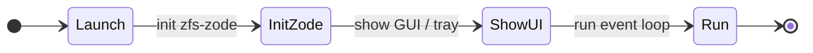

# ZFS v0.1.0 — Zode app (standalone)

## Purpose

The **zfs-zode-app** crate provides a **standalone** Zode application: run the node as its own app (e.g. desktop or system-tray), **not** the console-only binary. It has the same Zode capabilities as the console (persist, verify, policy, metrics) but a different UI surface and packaging.

## Requirements

- **Run Zode as standalone application:** Desktop app or system-tray; separate binary from console-only `zode-cli`.
- **Same Zode capabilities:** Uses `zfs-zode` for libp2p, storage, proof, policy, metrics—no direct RocksDB.
- **Different UI:** May reuse UI data contracts from `zfs-zode-cli` (status, programs, peers, log); app-specific UI (e.g. GUI, tray icon, settings).
- **Settings screen:** The app MUST provide a **Settings** screen where the operator can toggle default programs on or off (see [Default programs settings](#default-programs-settings) and [06-zode § Default programs](06-zode.md#default-programs)).
- **No direct RocksDB:** Uses `zfs-zode` library only.
- **Z Chat test messages (optional):** The app MAY embed an SDK client (or call into `zfs-sdk`) so the user can send **test messages** for Z Chat from the app. This allows operators to prove the system is working by sending and receiving messages (e.g. to a test channel) without a separate client. When implemented: use a dedicated test channel (e.g. `channel_id` reserved for "zode-app test"); key handling for the test channel is implementation-defined (e.g. fixed test key or generated and shown in UI). See [05-standard-programs](05-standard-programs.md) for Z Chat channel semantics.

## Interfaces

- **App entry point:** Binary (e.g. `zode-app`) that initializes Zode (via `zfs-zode`) and shows the app UI.
- **Embed or connect to Zode:** In-process: app starts Zode in a thread or async task; UI reads status/peers/log from Zode API. Optional: reuse the same data contracts as [07-zode-cli](07-zode-cli.md) (ZodeStatus, PeerInfo, LogEvent, etc.).
- **Optional shared contracts with zfs-zode-cli:** If the app uses the same status/peers/log types, it may depend on `zfs-zode-cli` for those types only, or define a small shared crate; otherwise keep contracts in `zfs-zode` and have both UI and app depend on Zode.

## Default programs settings

The Settings screen presents each default program (see [06-zode § Default programs](06-zode.md#default-programs)) as a toggle:

| Program | Default | Description shown to operator |
|---------|---------|-------------------------------|
| **ZID** (Zero Identity) | Enabled | Store and serve identity records. |
| **Z Chat** | Enabled | Store and serve encrypted chat messages. |

Toggling a program **off** removes it from the effective topic list; toggling it **on** re-adds it. Changes take effect on the next restart (or immediately if the implementation supports hot-reload of subscriptions). The UI persists the selection to the Zode config (see [06-zode § Settings persistence](06-zode.md#settings-persistence)).

```rust
pub struct DefaultProgramsSettingsView {
    pub programs: Vec<DefaultProgramToggle>,
}

pub struct DefaultProgramToggle {
    pub name: String,           // e.g. "ZID", "Z Chat"
    pub description: String,    // short explanation
    pub enabled: bool,          // current state
}
```

The Settings screen is reachable from the main navigation alongside Status, Peers, Log, and Info.

## Diagram (optional)

### App lifecycle



## Implementation

- **Crate:** `zfs-zode-app`. Deps: zfs-core, zfs-zode; optionally zfs-zode-cli for shared data contracts.
- **Binary:** Standalone app (e.g. desktop or system-tray). Separate from console-only binary.
- **Packaging:** May use a GUI framework (e.g. Tauri, egui) or system-tray library; not mandated in spec. Document in crate.
