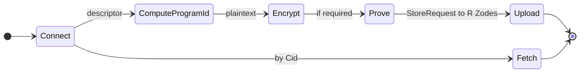

# ZFS v0.1.0 — SDK (client)

## Purpose

The **zfs-sdk** crate is the **client SDK**: connect to Zodes, compute program_id and topic, encrypt sectors, optionally generate Valid-Sector proofs, upload to R Zodes, fetch by CID, and manage heads. It includes built-in ZID and Z Chat helpers. The SDK wraps `zfs-net`, `zfs-crypto`, `zfs-proof`, and `zfs-programs`; it does **not** use RocksDB.

## Requirements

- **Connect / discover Zodes:** Via `zfs-net` (bootstrap peers, config). See [12-protocol](12-protocol.md).
- **Compute program_id and topic:** Via `zfs-programs` (ProgramDescriptor, program_id(), topic()).
- **Encrypt sector:** Via `zfs-crypto` (encrypt_sector or Encryptor). See [10-crypto](10-crypto.md).
- **Generate Valid-Sector proof (optional):** Via `zfs-proof` if program requires; optional per program.
- **Upload to R Zodes:** Send StoreRequest to R Zodes; replication factor R is a parameter. See [12-protocol](12-protocol.md) (replication semantics).
- **Fetch by CID:** Send FetchRequest; receive FetchResponse (ciphertext or head).
- **Head management:** Fetch/update head for a sector; helpers for head metadata.
- **ZID and Z Chat helpers:** Built-in helpers for ZID and Z Chat (create descriptor, build message, upload). See [05-standard-programs](05-standard-programs.md).
- **Abstract network:** All network via `zfs-net`; no direct libp2p in SDK.

## Interfaces (high-level client API)

```rust
// Connection
pub async fn connect(config: &SdkConfig) -> Result<Client, SdkError>;

// Program and topic
pub fn program_id(descriptor: &ProgramDescriptor) -> ProgramId;
pub fn topic(descriptor: &ProgramDescriptor) -> String;

// Crypto
pub fn encrypt_sector(plaintext: &[u8], key: &SectorKey, nonce: &[u8]) -> Result<Vec<u8>, CryptoError>;
pub fn decrypt_sector(ciphertext: &[u8], key: &SectorKey, nonce: &[u8]) -> Result<Vec<u8>, CryptoError>;

// Proof (optional)
pub fn prove(cid: &Cid, program_id: &ProgramId, version: u64, payload: &[u8]) -> Result<Vec<u8>, ProofError>;

// Store / fetch
pub async fn upload(
    client: &Client,
    program_id: &ProgramId,
    ciphertext: &[u8],
    head: Option<&Head>,
    proof: Option<&[u8]>,
    replication_factor: usize,  // R
) -> Result<StoreResult, SdkError>;

pub async fn fetch(client: &Client, program_id: &ProgramId, cid: &Cid) -> Result<FetchResult, SdkError>;

// Head helpers
pub async fn fetch_head(client: &Client, program_id: &ProgramId, sector_id: &SectorId) -> Result<Option<Head>, SdkError>;

// ZID / Z Chat helpers (conceptual)
pub fn zid_descriptor(...) -> ZidDescriptor;
pub fn zchat_descriptor(...) -> ZChatDescriptor;
// ... message builders and upload helpers
```

- **StoreResult:** At least one success (or all R) per [12-protocol](12-protocol.md); implementation-defined.
- **FetchResult:** Ciphertext and/or head; map to `ZfsError::NotFound` when missing.

## Client flow state machine



## Implementation

- **Crate:** `zfs-sdk`. Deps: zfs-core, zfs-crypto, zfs-programs, zfs-proof, zfs-net.
- **No direct RocksDB:** All persistence is on Zode side; SDK only sends store/fetch.
- **Replication factor R:** Parameter to upload (e.g. `replication_factor: usize`); semantics per [12-protocol](12-protocol.md) (at least one success).
- **ZID and Z Chat:** Helper APIs in SDK that use ProgramDescriptor and message types from [05-standard-programs](05-standard-programs.md); same encoding (CBOR) and proof rules.
