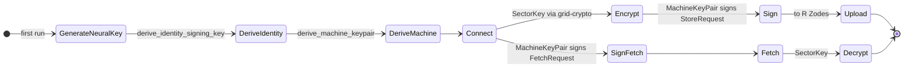

# The Grid v0.1.0 — SDK (client)

## Purpose

The **grid-sdk** crate is the **client SDK**: manage identity and machine keys, connect to Zodes, compute program_id and topic, encrypt sectors, sign operations, optionally generate Valid-Sector proofs, upload to R Zodes, fetch by CID, and manage heads. It includes built-in ZID and Interlink helpers. The SDK wraps `zero-neural`, `grid-net`, `grid-crypto`, `grid-proof`, and program crates; it does **not** use RocksDB.

## Requirements

- **Identity and keys:** Create identity via `zero-neural` (NeuralKey, IdentitySigningKey, MachineKeyPair). Machine enrollment per device.
- **Connect / discover Zodes:** Via `grid-net` (bootstrap peers, config). See [12-protocol](12-protocol.md).
- **Compute program_id and topic:** Via program crates (ProgramDescriptor, program_id(), topic()).
- **Encrypt sector:** Via `grid-crypto` (SectorKey generation, wrapping, encrypt_sector). See [10-crypto](10-crypto.md).
- **Sign operations:** All uploads are signed with the machine's hybrid key (Ed25519 + ML-DSA-65) via `zero-neural`.
- **Generate Valid-Sector proof (optional):** Via `grid-proof` if program requires; optional per program.
- **Upload to R Zodes:** Send signed StoreRequest to R Zodes; replication factor R is a parameter. See [12-protocol](12-protocol.md) (replication semantics).
- **Fetch by CID:** Send FetchRequest; receive FetchResponse (ciphertext or head).
- **Head management:** Fetch/update head for a sector; helpers for head metadata.
- **ZID and Interlink helpers:** Built-in helpers for ZID and Interlink (create descriptor, build message, upload). See [05-standard-programs](05-standard-programs.md).
- **Abstract network:** All network via `grid-net`; no direct libp2p in SDK.

## Interfaces (high-level client API)

### Identity and key management

```rust
// NeuralKey creation (one-time, first run)
let nk = NeuralKey::generate(&mut rng);   // 256-bit root secret via CSPRNG
// Caller is responsible for secure storage (e.g. Shamir splitting for recovery)

// Identity signing key derivation
pub fn derive_identity_signing_key(
    nk: &NeuralKey,
    identity_id: &[u8; 16],
) -> Result<IdentitySigningKey, CryptoError>;

// Machine key pair derivation (per device, per epoch)
pub fn derive_machine_keypair(
    nk: &NeuralKey,
    identity_id: &[u8; 16],
    machine_id: &[u8; 16],
    epoch: u64,
    capabilities: MachineKeyCapabilities,
) -> Result<MachineKeyPair, CryptoError>;
```

- **`NeuralKey::generate(rng)`:** Creates a new 256-bit root secret. Also available: `NeuralKey::from_bytes(bytes)` for reconstruction from backup.
- **`identity_id`:** 16-byte unique identity identifier; see [10-crypto](10-crypto.md).
- **`machine_id`:** 16-byte unique device identifier.
- **`epoch`:** Monotonic epoch for key rotation; incrementing epoch with the same machine_id produces different keys.
- **`capabilities`:** Bitflags (`SIGN`, `ENCRYPT`, `STORE`, `FETCH`) describing what the machine key is authorized to do; see [10-crypto](10-crypto.md).
- Both derivations are fallible (HKDF can theoretically fail with invalid output length).

### Connection and program

```rust
pub async fn connect(config: &SdkConfig) -> Result<Client, SdkError>;

pub fn program_id(descriptor: &ProgramDescriptor) -> ProgramId;
pub fn topic(descriptor: &ProgramDescriptor) -> String;
```

### Crypto

```rust
pub fn encrypt_sector(
    plaintext: &[u8],
    key: &SectorKey,
    aad: &[u8],
) -> Result<Vec<u8>, CryptoError>;

pub fn decrypt_sector(
    sealed: &[u8],
    key: &SectorKey,
    aad: &[u8],
) -> Result<Vec<u8>, CryptoError>;
```

### Proof (optional)

```rust
pub fn prove(
    cid: &Cid,
    program_id: &ProgramId,
    version: u64,
    payload: &[u8],
) -> Result<Vec<u8>, ProofError>;
```

### Store / fetch (signed)

```rust
pub async fn upload(
    client: &Client,
    machine_key: &MachineKeyPair,   // signs the request
    program_id: &ProgramId,
    ciphertext: &[u8],
    head: Option<&Head>,
    proof: Option<&[u8]>,
    replication_factor: usize,      // R
) -> Result<StoreResult, SdkError>;

pub async fn fetch(
    client: &Client,
    program_id: &ProgramId,
    cid: &Cid,
) -> Result<FetchResult, SdkError>;

pub async fn fetch_head(
    client: &Client,
    program_id: &ProgramId,
    sector_id: &SectorId,
) -> Result<Option<Head>, SdkError>;
```

### ZID / Interlink helpers (conceptual)

```rust
pub fn zid_descriptor(...) -> ZidDescriptor;
pub fn interlink_descriptor(...) -> InterlinkDescriptor;
// ... message builders and upload helpers
```

- **StoreResult:** At least one success (or all R) per [12-protocol](12-protocol.md); implementation-defined.
- **FetchResult:** Ciphertext and/or head; map to `GridError::NotFound` when missing.

## Client flow state machine



## Implementation

- **Crate:** `grid-sdk`. Deps: zero-neural, grid-core, grid-crypto, grid-proof, grid-net.
- **No direct RocksDB:** All persistence is on Zode side; SDK only sends store/fetch.
- **Replication factor R:** Parameter to upload (e.g. `replication_factor: usize`); semantics per [12-protocol](12-protocol.md) (at least one success).
- **Signing:** Every upload is signed by the caller's `MachineKeyPair` producing a `HybridSignature`. The `machine_did` is derived from the machine's Ed25519 public key via `ed25519_to_did_key` (provided by `zero-neural`).
- **SectorKey derivation:** SectorKeys are random 256-bit keys, wrapped per-recipient using the two-step hybrid key wrapping scheme in [10-crypto](10-crypto.md) (step 1: `zero-neural` hybrid encapsulation; step 2: `grid-crypto` sector-context-bound wrapping).
- **ZID and Interlink:** Helper APIs in SDK that use ProgramDescriptor and message types from [05-standard-programs](05-standard-programs.md); same encoding (CBOR) and proof rules.
