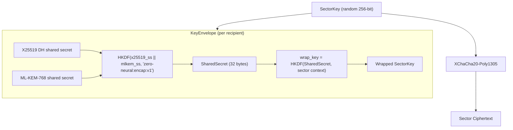
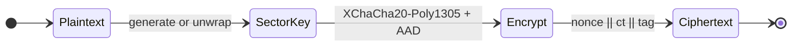
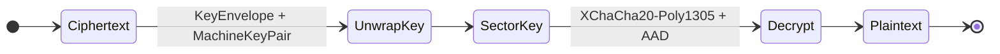

# ZFS v0.1.0 — Crypto (client-side encryption)

## Purpose

The `zfs-crypto` crate provides client-side encryption for sector payloads. ZFS is **encrypted-by-default**: only ciphertext exists at rest and on the wire; Zodes never see plaintext. Encryption and decryption are performed by the client (SDK); the Zode only stores and serves opaque bytes.

## Properties

- **Ciphertext-only at rest:** Zode stores and serves ciphertext. No key material is stored on the Zode.
- **Client encrypts before upload:** SDK (or client using the crate) encrypts the sector payload before sending a StoreRequest.
- **Key hierarchy:** Key derivation is rooted in `zero-neural` — a standalone PQ-Hybrid key crate. `zfs-crypto` depends on `zero-neural` for `MachineKeyPair`, `MachinePublicKey`, hybrid key encapsulation, and HKDF.

## Key hierarchy

All keys derive from a **NeuralKey** (256-bit root secret) via HKDF-SHA256 with zero-id-compatible domain separation. The full hierarchy is defined in the `zero-neural` crate; `zfs-crypto` consumes the derived Machine Key Pairs.

```
NeuralKey (256-bit CSPRNG)
  │
  ├── IdentitySigningKey  (Ed25519 + ML-DSA-65, via HKDF)
  │     Derived with: identity_id ([u8; 16])
  │     → IdentityVerifyingKey  (public half, via .verifying_key())
  │
  └── MachineKeyPair  (per device, per epoch)
        Derived with: identity_id, machine_id ([u8; 16]), epoch (u64), capabilities
        → MachinePublicKey  (public half, via .public_key())
        │
        ├── Ed25519      — classical signing
        ├── X25519       — classical key agreement
        ├── ML-DSA-65    — PQ signing
        └── ML-KEM-768   — PQ key encapsulation
```

Every MachineKeyPair always contains all four key types. There is no classical-only mode.

### Derivation parameters

| Key type | Required parameters | Description |
|----------|-------------------|-------------|
| `IdentitySigningKey` | `identity_id: [u8; 16]` | Unique identity identifier; same NeuralKey + identity_id always yields the same signing key. |
| `MachineKeyPair` | `identity_id: [u8; 16]`, `machine_id: [u8; 16]`, `epoch: u64`, `capabilities: MachineKeyCapabilities` | Per-device key set; epoch enables key rotation without changing machine_id. |

### MachineKeyCapabilities

Machine keys carry a bitflag describing what the machine is authorized to do:

```rust
bitflags! {
    pub struct MachineKeyCapabilities: u8 {
        const SIGN    = 0x01;
        const ENCRYPT = 0x02;
        const STORE   = 0x04;
        const FETCH   = 0x08;
    }
}
```

Capabilities are stored alongside the key pair and included in the public key. They are metadata (not enforced cryptographically) — enforcement is at the application/policy layer.

### Two-level machine key derivation

Machine key derivation is a two-level HKDF process:

1. **Machine seed:** `HKDF-SHA256(ikm = NeuralKey, info = "cypher:shared:machine:v1" || identity_id || machine_id || epoch)` → 32-byte machine seed.
2. **Individual key seeds:** From the machine seed, four separate HKDF calls derive seeds for each key type:
   - Ed25519 signing: `HKDF-SHA256(ikm = machine_seed, info = "cypher:shared:machine:sign:v1" || machine_id)`
   - X25519 encryption: `HKDF-SHA256(ikm = machine_seed, info = "cypher:shared:machine:encrypt:v1" || machine_id)`
   - ML-DSA-65 signing: `HKDF-SHA256(ikm = machine_seed, info = "cypher:shared:machine:pq-sign:v1" || machine_id)`
   - ML-KEM-768 encapsulation: `HKDF-SHA256(ikm = machine_seed, info = "cypher:shared:machine:pq-encrypt:v1" || machine_id)`

ML-KEM-768 key generation is deterministic: the PQ encrypt seed is further expanded via HKDF into `d` and `z` parameters for `MlKem768::generate_deterministic`.

### HKDF domain separation strings

All HKDF derivations use `salt = None` and SHA-256. The info strings follow a `cypher:` prefix convention for zero-id compatibility:

| Derivation | Info string |
|-----------|-------------|
| Identity signing (Ed25519) | `"cypher:id:identity:v1" \|\| identity_id` |
| Identity signing (ML-DSA-65) | `"cypher:id:identity:pq-sign:v1" \|\| identity_id` |
| Machine seed | `"cypher:shared:machine:v1" \|\| identity_id \|\| machine_id \|\| epoch_be_bytes` |
| Machine Ed25519 | `"cypher:shared:machine:sign:v1" \|\| machine_id` |
| Machine X25519 | `"cypher:shared:machine:encrypt:v1" \|\| machine_id` |
| Machine ML-DSA-65 | `"cypher:shared:machine:pq-sign:v1" \|\| machine_id` |
| Machine ML-KEM-768 | `"cypher:shared:machine:pq-encrypt:v1" \|\| machine_id` |
| ML-KEM-768 d parameter | `"mlkem768:d"` (from PQ encrypt seed) |
| ML-KEM-768 z parameter | `"mlkem768:z"` (from PQ encrypt seed) |
| Hybrid encap combine | `"zero-neural:encap:v1"` |

## Sector encryption

### Algorithm

- **Cipher:** XChaCha20-Poly1305 (AEAD)
- **Nonce:** 192-bit, randomly generated per encryption, prepended to ciphertext
- **AAD:** `program_id || sector_id` — binds ciphertext to its sector and program
- **SectorKey:** Random 256-bit symmetric key, generated via CSPRNG when the sector is created

### Scheme: random SectorKey + recipient wrapping

Every sector uses the same pattern regardless of the number of owners:

1. **Generate** a random 256-bit SectorKey (CSPRNG) when the sector is created
2. **Wrap** the SectorKey to each recipient using hybrid key wrapping (see [Key wrapping](#key-wrapping--always-hybrid))
3. **Store** the wrapped key(s) alongside the sector as a `KeyEnvelope`
4. **To share later:** wrap the same SectorKey to additional recipients and append to the envelope — the sector ciphertext is untouched

Single-owner is just one wrapped key (to your own machine encryption key). Sharing means adding more wrapped copies of the same SectorKey. No re-encryption of the sector payload is ever needed.



### Key wrapping — always hybrid

Key wrapping is a **two-step** process that separates the key agreement (in `zero-neural`) from the sector-specific wrapping (in `zfs-crypto`):

**Step 1 — Hybrid key agreement (`zero-neural`):**

The sender performs X25519 DH and ML-KEM-768 encapsulation against the recipient's public key, then combines both shared secrets via HKDF:

```
x25519_ss  = X25519(sender_machine_x25519_secret, recipient_x25519_public)
(mlkem_ct, mlkem_ss) = ML-KEM-768.Encapsulate(recipient_mlkem_public)

shared_secret = HKDF-SHA256(
    ikm  = x25519_ss || mlkem_ss,
    salt = None,
    info = "zero-neural:encap:v1"
)
```

This produces a `SharedSecret` (32 bytes) and an `EncapBundle` (sender's X25519 public key + ML-KEM ciphertext). The ML-KEM encapsulation uses `OsRng` directly (not injectable); the result is non-deterministic per encapsulation even with the same keys.

**Step 2 — Sector key wrapping (`zfs-crypto`):**

The shared secret is used to derive a context-bound wrap key, then the SectorKey is encrypted:

```
wrap_key = HKDF-SHA256(
    ikm  = shared_secret,
    salt = None,
    info = "zfs:sector-key-wrap:v1" || program_id || sector_id
)

wrapped_sector_key = XChaCha20-Poly1305(
    key       = wrap_key,
    nonce     = random 192-bit,
    plaintext = sector_key_bytes
)
```

An attacker must break both X25519 and ML-KEM to recover the SharedSecret, and additionally needs the program/sector context to derive the wrap key.

### KeyEnvelope

Stored alongside sector ciphertext (or in a dedicated key-envelope block):

```rust
pub struct KeyEnvelope {
    pub entries: Vec<KeyEnvelopeEntry>,
}

pub struct KeyEnvelopeEntry {
    pub recipient_did: String,          // did:key of recipient machine
    pub sender_x25519_public: [u8; 32], // sender's static machine X25519 public key
    pub mlkem_ciphertext: Vec<u8>,      // ML-KEM-768 ciphertext (1,088 B)
    pub wrapped_key: Vec<u8>,           // nonce (24) || encrypted SectorKey (32) || tag (16) = 72 bytes
}
```

Each envelope entry is ~1,192 bytes (the ML-KEM ciphertext dominates). The sender's X25519 public key is the **static** key from the sender's `MachineKeyPair` (not an ephemeral key); the recipient uses this along with the `machine_did` to look up the sender's full `MachinePublicKey` for decapsulation.

### Granting and revoking access

- **Granting access** to a new recipient = create a new `KeyEnvelopeEntry` for their public key and append it. Any current holder of the SectorKey can do this. No change to the sector ciphertext.
- **Revoking access** = rotate the SectorKey: generate a new one, re-encrypt the sector, create a fresh `KeyEnvelope` with only the remaining recipients. This is an explicit operation, not automatic.

## DID encoding

`zero-neural` provides `did:key` encoding and decoding for Ed25519 public keys (see [Interfaces](#did-encoding-1) for signatures):

- **Encode:** `ed25519_to_did_key(pk: &[u8; 32]) -> String` — produces `"did:key:z" + base58btc(0xed01 || pk)`
- **Decode:** `did_key_to_ed25519(did: &str) -> Result<[u8; 32], CryptoError>` — parses and validates

The multicodec prefix `0xed01` identifies Ed25519 public keys. DIDs are used in `KeyEnvelopeEntry.recipient_did`, `StoreRequest.machine_did`, and identity resolution. The Ed25519 public bytes needed for encoding are accessible via `MachinePublicKey::ed25519_bytes()` or `IdentitySigningKey::ed25519_public_bytes()`.

## Interfaces

### SectorKey

```rust
pub struct SectorKey([u8; 32]); // Zeroize + ZeroizeOnDrop

SectorKey::generate() -> SectorKey
```

### Encrypt / Decrypt

```rust
pub fn encrypt_sector(
    plaintext: &[u8],
    key: &SectorKey,
    aad: &[u8],                 // program_id || sector_id
) -> Result<Vec<u8>, CryptoError>;   // nonce (24) || ciphertext || tag (16)

pub fn decrypt_sector(
    sealed: &[u8],
    key: &SectorKey,
    aad: &[u8],
) -> Result<Vec<u8>, CryptoError>;
```

### Key wrapping

```rust
pub fn wrap_sector_key(
    sector_key: &SectorKey,
    sender: &MachineKeyPair,
    recipient_public: &MachinePublicKey,
    program_id: &ProgramId,
    sector_id: &SectorId,
) -> KeyEnvelopeEntry;

pub fn unwrap_sector_key(
    entry: &KeyEnvelopeEntry,
    recipient: &MachineKeyPair,
    sender_public: &MachinePublicKey,   // looked up by recipient_did / machine_did
    program_id: &ProgramId,
    sector_id: &SectorId,
) -> Result<SectorKey, CryptoError>;
```

### zero-neural types and functions (implemented)

These are the `zero-neural` primitives used by `zfs-crypto` and `zfs-sdk`. All types listed here are publicly exported from the `zero-neural` crate.

#### NeuralKey

```rust
pub struct NeuralKey([u8; 32]); // Zeroize + ZeroizeOnDrop

impl NeuralKey {
    pub fn generate(rng: &mut (impl RngCore + CryptoRng)) -> Self;
    pub fn from_bytes(bytes: [u8; 32]) -> Self;
    // as_bytes() is pub(crate) only — not exposed outside zero-neural
}
```

#### Top-level derivation functions

```rust
pub fn derive_identity_signing_key(
    nk: &NeuralKey,
    identity_id: &[u8; 16],
) -> Result<IdentitySigningKey, CryptoError>;

pub fn derive_machine_keypair(
    nk: &NeuralKey,
    identity_id: &[u8; 16],
    machine_id: &[u8; 16],
    epoch: u64,
    capabilities: MachineKeyCapabilities,
) -> Result<MachineKeyPair, CryptoError>;
```

#### Signing and verification

```rust
pub struct HybridSignature {
    pub ed25519: [u8; 64],
    pub ml_dsa: Vec<u8>,          // 3,309 bytes for ML-DSA-65
}

impl HybridSignature {
    pub const ED25519_LEN: usize = 64;
    pub const ML_DSA_65_LEN: usize = 3_309;
    pub fn to_bytes(&self) -> Vec<u8>;                         // ed25519 || ml_dsa
    pub fn from_bytes(bytes: &[u8]) -> Result<Self, CryptoError>;
}

impl IdentitySigningKey {  // ZeroizeOnDrop
    pub fn sign(&self, msg: &[u8]) -> HybridSignature;
    pub fn verifying_key(&self) -> IdentityVerifyingKey;
    pub fn ed25519_public_bytes(&self) -> [u8; 32];
}

pub struct IdentityVerifyingKey; // Clone

impl IdentityVerifyingKey {
    pub fn verify(&self, msg: &[u8], sig: &HybridSignature) -> Result<(), CryptoError>;
    pub fn ed25519_bytes(&self) -> [u8; 32];
}

impl MachineKeyPair {
    pub fn sign(&self, msg: &[u8]) -> HybridSignature;
    pub fn public_key(&self) -> MachinePublicKey;
    pub fn capabilities(&self) -> MachineKeyCapabilities;
    pub fn epoch(&self) -> u64;
}

impl MachinePublicKey {
    pub fn verify(&self, msg: &[u8], sig: &HybridSignature) -> Result<(), CryptoError>;
    pub fn ed25519_bytes(&self) -> [u8; 32];
    pub fn capabilities(&self) -> MachineKeyCapabilities;
    pub fn epoch(&self) -> u64;
}
```

Both `IdentityVerifyingKey::verify` and `MachinePublicKey::verify` require **both** Ed25519 and ML-DSA-65 components to pass; either failing returns `CryptoError`.

#### Hybrid encapsulation

```rust
// Encapsulate (sender → recipient)
impl MachinePublicKey {
    pub fn encapsulate(
        &self,                      // recipient's public key
        sender: &MachineKeyPair,
    ) -> Result<(SharedSecret, EncapBundle), CryptoError>;
}

// Decapsulate (recipient receives from sender)
impl MachineKeyPair {
    pub fn decapsulate(
        &self,                      // recipient's key pair
        bundle: &EncapBundle,
        sender_public: &MachinePublicKey,
    ) -> Result<SharedSecret, CryptoError>;
}

pub struct EncapBundle {
    pub x25519_public: [u8; 32],    // sender's static X25519 public key
    pub mlkem_ciphertext: Vec<u8>,  // ML-KEM-768 ciphertext (1,088 B)
}

impl EncapBundle {
    pub fn to_bytes(&self) -> Vec<u8>;                          // x25519_public || mlkem_ciphertext
    pub fn from_bytes(bytes: &[u8]) -> Result<Self, CryptoError>;
}

pub struct SharedSecret([u8; 32]);  // Zeroize + ZeroizeOnDrop

impl SharedSecret {
    pub fn as_bytes(&self) -> &[u8; 32];
}
```

Note: during `decapsulate`, the X25519 DH is computed using `sender_public`'s X25519 key (not `bundle.x25519_public`). The bundle's `x25519_public` field is for transport/identification (stored in `KeyEnvelopeEntry`); the actual DH uses the verified `MachinePublicKey` looked up by the recipient.

#### DID encoding

```rust
pub fn ed25519_to_did_key(pk: &[u8; 32]) -> String;
pub fn did_key_to_ed25519(did: &str) -> Result<[u8; 32], CryptoError>;
```

#### CryptoError

```rust
pub enum CryptoError {
    HkdfExpandFailed,
    Ed25519VerifyFailed,
    MlDsaVerifyFailed,
    HybridVerifyFailed(&'static str),
    MlKemDecapFailed,
    X25519ZeroSharedSecret,
    InvalidDid(String),
    InvalidKeyLength { expected: usize, got: usize },
    InvalidCiphertextLength { expected: usize, got: usize },
}
```

## Diagrams

### Encrypt flow



### Decrypt flow



## Implementation

- **Crate:** `zfs-crypto`. Deps: `zero-neural`, `zfs-core`.
- **Use only in:** SDK and client code. Zode does **not** use this crate for payload crypto.
- **Algorithm:** XChaCha20-Poly1305 for sector encryption and key wrapping. Hybrid (X25519 + ML-KEM-768) for key agreement.
- **Two-step wrapping:** Step 1 (key agreement) is in `zero-neural`; step 2 (sector-context-bound wrapping) is in `zfs-crypto`.
- **Errors:** `CryptoError` for decryption failure, invalid length, etc.; do not leak key material.
