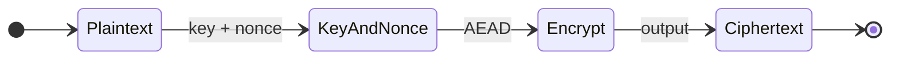
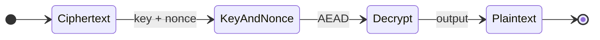

# ZFS v0.1.0 — Crypto (client-side encryption)

## Purpose

The `zfs-crypto` crate provides client-side encryption for sector payloads. ZFS is **encrypted-by-default**: only ciphertext exists at rest and on the wire; Zodes never see plaintext. Encryption and decryption are performed by the client (SDK); the Zode only stores and serves opaque bytes.

## Properties

- **Ciphertext-only at rest:** Zode stores and serves ciphertext. No key material is stored on the Zode.
- **Client encrypts before upload:** SDK (or client using the crate) encrypts the sector payload before sending a StoreRequest.
- **Key handling:** Key derivation and key material are **not** specified in this spec (implementation-defined). The spec only defines the **API** and **cipher/nonce rules**.

## Interfaces

### Encrypt / Decrypt

Two styles are allowed; the crate may expose either or both:

**Function-based:**

```rust
pub fn encrypt_sector(
    plaintext: &[u8],
    key: &SectorKey,
    nonce: &[u8],
) -> Result<Vec<u8>, CryptoError>;

pub fn decrypt_sector(
    ciphertext: &[u8],
    key: &SectorKey,
    nonce: &[u8],
) -> Result<Vec<u8>, CryptoError>;
```

**Trait-based (stateful encryptor/decryptor):**

```rust
pub trait Encryptor {
    fn encrypt(&mut self, plaintext: &[u8]) -> Result<(Vec<u8>, Nonce), CryptoError>;
}

pub trait Decryptor {
    fn decrypt(&mut self, ciphertext: &[u8], nonce: &Nonce) -> Result<Vec<u8>, CryptoError>;
}
```

- **SectorKey:** Opaque or typed key (e.g. from key derivation). No key material format is mandated.
- **Nonce/IV:** Must be unique per encryption with the same key. Size and format are implementation-defined (e.g. 96-bit or 192-bit); nonce may be stored/transmitted alongside ciphertext or derived.

### Cipher suite and nonce rules

- **Cipher:** AEAD (Authenticated Encryption with Associated Data). Algorithm is **not** mandated; implementation may choose e.g. **XChaCha20-Poly1305** or AES-GCM.
- **Nonce/IV:** Must never be reused for the same key. Typically 96 or 192 bits; either prepended to ciphertext or sent in protocol (see [12-protocol](12-protocol.md) if nonce is in the message).
- **Associated data (AAD):** Optional; if used, may include Cid, program_id, or version for binding. Left to implementation.

### Key derivation

- **API:** Key derivation is part of the crate but not specified in this doc (no key material in spec). Typical pattern: `derive_key(secret, context) -> SectorKey` or similar.
- **Usage:** Only inside SDK and client; Zode never performs derivation or decryption.

## Diagrams

### Encrypt flow



### Decrypt flow



## Implementation

- **Crate:** `zfs-crypto`. Deps: `zfs-core` only (if it needs types like `Cid` for AAD).
- **Use only in:** SDK and client code. Zode does **not** use this crate for payload crypto.
- **Algorithm:** Left to implementation (e.g. XChaCha20-Poly1305). Document choice in crate docs.
- **Errors:** `CryptoError` for decryption failure, invalid length, etc.; do not leak key material.
