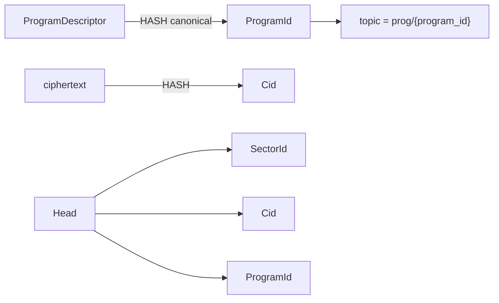

# ZFS v0.1.0 — Core types

## Purpose

The `zfs-core` crate provides shared types and identifiers used by storage, programs, proof, net, zode, and SDK. It has **no I/O**: no RocksDB, no network. All serialization and canonical encoding rules are defined here for consistency across the system.

## Canonical serialization

- **Choice:** CBOR (RFC 8949) with deterministic encoding (RFC 8949 §4.2.1) for all canonical forms.
- **Usage:** `ProgramDescriptor`, `Head`, and protocol messages use CBOR for canonical bytes. Hashes are computed over these canonical bytes where applicable.
- **Binary format:** Multi-byte integers and lengths use big-endian where CBOR does not specify otherwise.

## Public types

### Identifiers

| Type | Description | Byte format |
|------|-------------|-------------|
| `Cid` | Content identifier for a sector payload. | See [CID derivation](#cid-derivation). |
| `SectorId` | Opaque sector identifier (e.g. logical sector in a program). | Canonical bytes (e.g. CBOR) then hex or raw bytes in APIs. |
| `ProgramId` | Program identity; see [03-programs-and-topics](03-programs-and-topics.md). | `HASH(program_descriptor_canonical)`; 32 bytes, hex-encoded in APIs. |
| `ZodeId` | Zode identity on the network (wraps libp2p PeerId). | libp2p PeerId bytes; no hashing in core. Human-readable form is `Zx`-prefixed (e.g. `Zx12D3KooW…`). The prefix is display-only — wire and storage use raw PeerId bytes. |

### CID derivation

- **Rule:** `Cid = H(ciphertext)`. The content identifier is the cryptographic hash of the **ciphertext** (the payload as stored and transmitted). This ensures:
  - Same ciphertext ⇒ same Cid (content-addressed).
  - Clients and Zodes can compute Cid from the bytes they have without decryption.
- **Hash function:** SHA-256. Output 32 bytes.
- **Byte format:** Raw 32 bytes in storage and wire; hex string (64 chars) in logging and UI.
- **API:** `Cid::from_ciphertext(bytes: &[u8]) -> Cid`; `cid.as_bytes() -> [u8; 32]`; `cid.to_hex() -> String`.

### Head

Represents the current head of a sector (latest version) for a program.

| Field | Type | Description |
|-------|------|-------------|
| `sector_id` | `SectorId` | Sector this head refers to. |
| `cid` | `Cid` | Content ID of the latest stored block. |
| `version` | `u64` | Monotonic version number. |
| `program_id` | `ProgramId` | Program this head belongs to. |
| `prev_head_cid` | `Option<Cid>` | Previous head Cid (if any) for lineage. |
| `timestamp_ms` | `u64` | Unix timestamp in milliseconds (client or Zode set). |

**Serialization:** Canonical CBOR. Used in [02-storage](02-storage.md) for sector head values and in protocol messages. The protocol layer ([12-protocol](12-protocol.md)) extends `Head` with an optional `signature: Option<HybridSignature>` field for cryptographic attribution; the canonical CBOR encoding must handle this optional field consistently.

### ProgramDescriptor (base)

Base descriptor used to derive `ProgramId`. See [03-programs-and-topics](03-programs-and-topics.md) for full definition and canonical encoding. Core only defines the type and that `program_id = HASH(canonical(ProgramDescriptor))`.

## Rust-like interfaces (summary)

```rust
// Identifiers (newtype wrappers with inner bytes)
pub struct Cid([u8; 32]);
pub struct SectorId(Vec<u8>);  // or fixed size per program
pub struct ProgramId([u8; 32]);
pub type ZodeId = libp2p::PeerId;

/// Format a ZodeId for display with the canonical `Zx` prefix.
pub fn format_zode_id(id: &ZodeId) -> String;
/// Parse a `Zx`-prefixed string back into a ZodeId.
pub fn parse_zode_id(s: &str) -> Result<ZodeId, ParseError>;

impl Cid {
    pub fn from_ciphertext(ciphertext: &[u8]) -> Self;
    pub fn as_bytes(&self) -> &[u8; 32];
    pub fn to_hex(&self) -> String;
    pub fn from_bytes(bytes: [u8; 32]) -> Result<Self, InvalidCid>;
}

pub struct Head {
    pub sector_id: SectorId,
    pub cid: Cid,
    pub version: u64,
    pub program_id: ProgramId,
    pub prev_head_cid: Option<Cid>,
    pub timestamp_ms: u64,
}

impl Head {
    pub fn encode_canonical(&self) -> Result<Vec<u8>, EncodeError>;
    pub fn decode_canonical(bytes: &[u8]) -> Result<Self, DecodeError>;
}

// Base for program identity
pub struct ProgramDescriptor { /* program-specific; canonical CBOR */ }
```

## Shared error and rejection codes

Used by Zode, SDK, and UI so that rejections and errors have a common semantics. Stored in `zfs-core` (or a shared error module referenced by core).

| Code | Name | Meaning |
|------|------|---------|
| `StorageFull` | Storage full | Zode refused: DB or program quota exceeded. |
| `ProofInvalid` | Proof invalid | Valid-Sector proof verification failed. |
| `PolicyReject` | Policy reject | Zode rejected due to local policy (e.g. program not allowed, size limit). |
| `NotFound` | Not found | Requested Cid or sector not present. |
| `InvalidPayload` | Invalid payload | Malformed or invalid request/block. |
| `ProgramMismatch` | Program mismatch | Cid/program_id does not match topic or index. |

```rust
pub enum ZfsError {
    StorageFull,
    ProofInvalid,
    PolicyReject,
    NotFound,
    InvalidPayload,
    ProgramMismatch,
    Io(/* underlying IO error */),
    Encode(EncodeError),
    Decode(DecodeError),
    Other(String),
}
```

## Relationship diagram



## Implementation notes

- **Crate:** `zfs-core`. No dependencies on RocksDB or network crates.
- **Used by:** zfs-storage, zfs-programs, zfs-proof, zfs-net, zfs-zode, zfs-sdk.
- **Serialization:** Use a single CBOR library with deterministic encoding; same choice in [12-protocol](12-protocol.md) for protocol messages.
