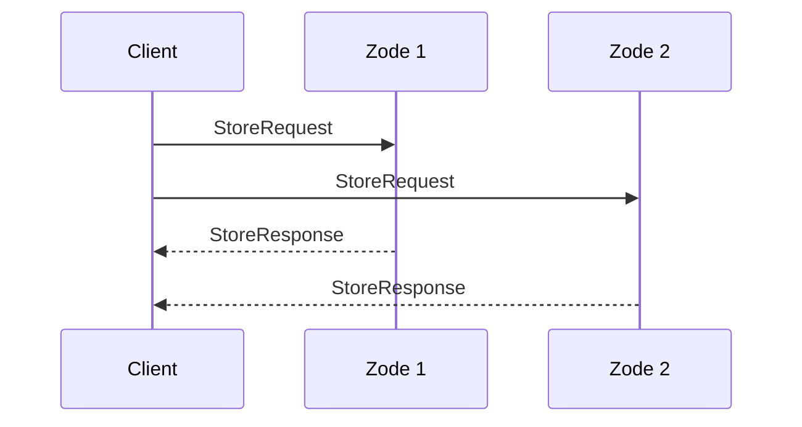
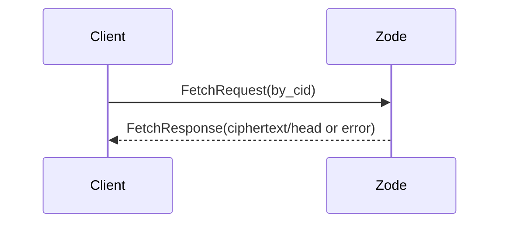
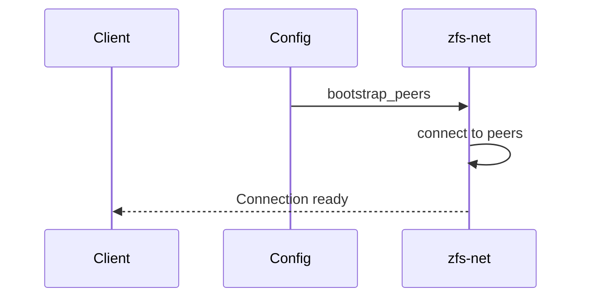

# ZFS v0.1.0 — Protocol (v1)

## Purpose

This document defines the v1 protocol: message types, wire format, transport (how store/fetch are sent), discovery, and replication semantics. Implemented in `zfs-net` (wire) and used by `zfs-zode` and `zfs-sdk`.

## Message types

| Message | Direction | Description |
|---------|-----------|-------------|
| **StoreRequest** | Client → Zode | Store a block (ciphertext) and optional head; optional proof. |
| **StoreResponse** | Zode → Client | Success or rejection (with error code). |
| **FetchRequest** | Client → Zode | Request block or head by Cid or sector. |
| **FetchResponse** | Zode → Client | Block ciphertext, head, or error. |

All messages may be wrapped in an **envelope** with `program_id`, `version`, and/or topic for routing and validation.

## Wire format

- **Serialization:** Canonical CBOR (same as [11-core-types](11-core-types.md)) for all protocol messages.
- **Consistency:** Same CBOR library and deterministic encoding as core types and storage.

Example envelope (conceptual):

```rust
pub struct StoreRequest {
    pub program_id: ProgramId,
    pub cid: Cid,
    pub ciphertext: Vec<u8>,
    pub head: Option<Head>,
    pub proof: Option<Vec<u8>>,
}

pub struct StoreResponse {
    pub ok: bool,
    pub error_code: Option<ZfsError>,  // if !ok
}

pub struct FetchRequest {
    pub program_id: ProgramId,
    pub by_cid: Option<Cid>,
    pub by_sector_id: Option<SectorId>,
}

pub struct FetchResponse {
    pub ciphertext: Option<Vec<u8>>,
    pub head: Option<Head>,
    pub error_code: Option<ZfsError>,
}
```

(Exact field names and optional envelope wrapper can be refined in implementation.)

## Transport

- **Discovery:** See [Discovery](#discovery). Clients discover Zode peers via bootstrap list, config, DHT, or mDNS.
- **Connection:** libp2p + QUIC. Handshake/identify as per libp2p.
- **Store / Fetch:** Sent as **request-response** over libp2p request-response protocol. Topic (GossipSub) is used for **subscription** and possibly for broadcast/announce; actual store/fetch payloads use request-response so the client gets a direct StoreResponse/FetchResponse.
- **Topic usage:** Zodes subscribe to `prog/{program_id}` (see [03-programs-and-topics](03-programs-and-topics.md)). Requests may be routed or validated using program_id; topic subscription does not replace request-response for store/fetch.

## Discovery

- **Bootstrap peers:** Configurable list of multiaddrs (e.g. in config file or env). Client and Zode can use bootstrap to find the network.
- **Config file:** Zode and SDK config may include `bootstrap_peers: Vec<Multiaddr>`.
- **DHT / mDNS:** Optional; implementation may use libp2p Kademlia DHT or mDNS for peer discovery. Not mandated for v0.1.0; bootstrap list is sufficient.
- **Connect API:** `connect(bootstrap_peers, config) -> Result<Connection, Error>` (conceptual). SDK uses this to connect to Zodes before sending store/fetch.

## Replication semantics

- **Replication factor R:** Client chooses R (e.g. number of Zodes to store to). Passed as parameter in SDK (see [09-sdk](09-sdk.md)).
- **Partial success:** Semantics are **at least one success** for store: if at least one of R Zodes accepts, the client may consider the store successful. Optional stricter mode "all R" can be implementation-defined.
- **Fetch:** Client may fetch from any Zode that has the Cid; no consensus. First successful FetchResponse wins (or implementation-defined strategy).

## Interfaces (summary)

- **Message structs:** `StoreRequest`, `StoreResponse`, `FetchRequest`, `FetchResponse` (and optional envelope).
- **Serialization:** `encode_canonical` / `decode_canonical` (CBOR).
- **Discovery:** `bootstrap_peers` in config; `connect(peers, config)` in `zfs-net` API.
- **Send/receive:** Implemented in `zfs-net`; Zode and SDK use the same API (send store request, receive store response, etc.).

## Sequence diagrams

### Client store (to R Zodes)



### Client fetch (by Cid)



### Discovery flow



## Implementation

- **Crate:** `zfs-net`. Implements wire format, request-response, and discovery; used by `zfs-zode` and `zfs-sdk`.
- **06-zode and 09-sdk** reference this spec for message shapes and replication semantics.
