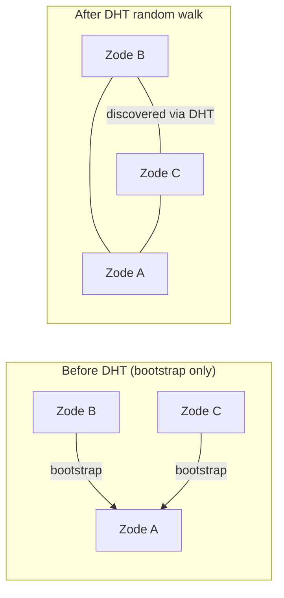

# The Grid v0.1.0 — Kademlia DHT Peer Discovery

## Purpose

[12-protocol](12-protocol.md) defines peer discovery via bootstrap peers only. This works for small, manually-configured networks but does not scale: each node must be told about every peer it should connect to, and there is no automatic propagation of new peers through the network.

This document specifies **Kademlia DHT-based peer discovery** for `grid-net`, enabling automatic multi-hop peer discovery where nodes find each other transitively through the routing table. A node that bootstraps to a single known peer will eventually discover the full network.

## Requirements

### Must

| # | Requirement |
|---|-------------|
| D-1 | Add `libp2p::kad::Behaviour` (Kademlia DHT) to the `grid-net` swarm behaviour. |
| D-2 | Kademlia must use a Grid-specific protocol name (e.g. `/grid/kad/1.0.0`) so Grid nodes only discover other Grid nodes, not unrelated libp2p peers. |
| D-3 | On startup, if bootstrap peers are configured, add them to the Kademlia routing table and trigger an initial bootstrap (`kad::Behaviour::bootstrap()`). |
| D-4 | Perform periodic random walks (`kad::Behaviour::get_closest_peers(random_key)`) to keep the routing table populated and discover new peers joining the network. |
| D-5 | DHT discovery must be enabled by default via `NetworkConfig` and can be disabled with `enable_kademlia: false` for bootstrap-only mode. |
| D-6 | Expose a `NetworkEvent::PeerDiscovered { zode_id, addresses }` event so `zode` and `grid-sdk` can observe newly discovered Zodes. |
| D-7 | Newly discovered peers must be automatically dialed so that GossipSub and request-response can operate over the expanded peer set. |

### Should

| # | Requirement |
|---|-------------|
| D-8 | Support **server mode** and **client mode** Kademlia. Zodes (long-lived, publicly reachable) should run in server mode; SDK clients (short-lived, possibly behind NAT) should run in client mode. Configurable via `NetworkConfig`. |
| D-9 | Expose DHT routing table size in `NetworkEvent` or via a query method so the UI can display the number of known peers vs connected peers. |
| D-10 | Rate-limit automatic dialing of discovered peers to avoid connection storms on large networks. |

### May

| # | Requirement |
|---|-------------|
| D-11 | Support mDNS for local network discovery (e.g. `libp2p::mdns::tokio::Behaviour`). Useful for development and LAN setups where no bootstrap peer is configured. |
| D-12 | Support provider records: Zodes announce which `program_id` topics they serve, allowing clients to query the DHT for "which peers serve program X?" instead of broadcasting to all peers. |

## Configuration

Extend `NetworkConfig` with discovery settings:

```rust
pub struct NetworkConfig {
    pub listen_addr: Multiaddr,
    pub bootstrap_peers: Vec<Multiaddr>,

    // --- new fields ---
    pub discovery: DiscoveryConfig,
}

pub struct DiscoveryConfig {
    /// Enable Kademlia DHT for automatic peer discovery.
    /// Default: true.
    pub enable_kademlia: bool,

    /// Kademlia mode. Zodes should use Server; SDK clients should use Client.
    /// Server mode: this node responds to DHT queries from other peers.
    /// Client mode: this node queries the DHT but does not serve routing info.
    /// Default: Server.
    pub kademlia_mode: KademliaMode,

    /// Interval between random walk queries to discover new peers.
    /// Default: 30 seconds.
    pub random_walk_interval: Duration,

    /// Maximum number of concurrent outbound dials triggered by discovery.
    /// Prevents connection storms when many peers are discovered at once.
    /// Default: 8.
    pub max_concurrent_discovery_dials: usize,

    /// Enable mDNS for local network peer discovery.
    /// Default: false.
    pub enable_mdns: bool,
}

pub enum KademliaMode {
    Server,
    Client,
}
```

`DiscoveryConfig` defaults to `enable_kademlia: true` so Kademlia DHT discovery is active out of the box. Pass `enable_kademlia: false` to fall back to bootstrap-only mode.

## Behaviour changes

### Swarm behaviour

```rust
#[derive(NetworkBehaviour)]
pub(crate) struct GridBehaviour {
    pub(crate) gossipsub: libp2p::gossipsub::Behaviour,
    pub(crate) request_response: libp2p::request_response::cbor::Behaviour<ZfsRequest, ZfsResponse>,

    // --- new ---
    pub(crate) kademlia: libp2p::kad::Behaviour<libp2p::kad::store::MemoryStore>,
    // optional:
    // pub(crate) mdns: Toggle<libp2p::mdns::tokio::Behaviour>,
}
```

Kademlia is always present in the behaviour struct but only actively used (bootstrap, random walk) when `enable_kademlia` is true. When disabled, it sits idle — no queries are issued, no routing table is maintained, and incoming DHT requests are ignored.

### Startup sequence

When `enable_kademlia` is true:

1. Configure Kademlia with protocol name `/grid/kad/1.0.0` and `MemoryStore`.
2. Set mode to `Server` or `Client` per config.
3. For each bootstrap peer multiaddr, add the peer to the Kademlia routing table via `kad::Behaviour::add_address`.
4. Call `kad::Behaviour::bootstrap()` to trigger the initial routing table population.
5. Start the periodic random walk timer.

### Random walk

A background task (or timer within the event loop) periodically calls:

```rust
let random_key = PeerId::random();
kademlia.get_closest_peers(random_key);
```

This forces the node to query its routing table, contact known peers, and learn about new peers those peers know. The interval is configurable via `random_walk_interval` (default 30s).

### Discovered peer handling

When Kademlia reports a discovered peer (via `KademliaEvent::RoutingUpdated` or query results):

1. Emit `NetworkEvent::PeerDiscovered { zode_id, addresses }`.
2. If the Zode is not already connected, dial it (subject to `max_concurrent_discovery_dials` limit).
3. Once connected, GossipSub and request-response automatically work with the new peer.

### Event mapping

New swarm events to handle in `NetworkService::next_event`:

| Kademlia event | Action |
|----------------|--------|
| `RoutingUpdated { peer, addresses, .. }` | Emit `PeerDiscovered`. Auto-dial if not connected. |
| `OutboundQueryProgressed { result: GetClosestPeers(Ok(..)), .. }` | For each peer in results: add to routing table, emit `PeerDiscovered` if new. |
| `OutboundQueryProgressed { result: Bootstrap(Ok(..)), .. }` | Log completion. Routing table is now seeded. |
| Other | Log at debug level; no user-facing event. |

## Network event additions

```rust
pub enum NetworkEvent {
    // ... existing variants ...

    /// A new Zode was discovered via DHT or mDNS (not yet necessarily connected).
    PeerDiscovered {
        zode_id: ZodeId,
        addresses: Vec<Multiaddr>,
    },
}
```

## Impact on other crates

### zode

- **`ZodeConfig`**: No changes required. `ZodeConfig.network` already contains `NetworkConfig`; the new `DiscoveryConfig` field is added there.
- **Event loop**: Handle the new `NetworkEvent::PeerDiscovered` variant (log it, optionally emit a `LogEvent`).
- **Status**: Consider exposing routing table size alongside `peer_count` (known vs connected).

### grid-sdk

- **`SdkConfig`**: No changes required; inherits `NetworkConfig` expansion.
- **Client event loop**: Handle `PeerDiscovered` — discovered Zodes can be added to the zode list for upload/fetch.
- **Client mode Kademlia**: SDK clients should default to `KademliaMode::Client` so they don't serve as DHT routers.

### zode-cli / zode-app

- Display "Known peers" (routing table size) in addition to "Connected peers" in Status/Peers screens.
- Show `[DHT] discovered <zode_id>` events in the live log.
- Settings: add a toggle for enabling Kademlia discovery.

## Diagrams

### Discovery flow with DHT

```mermaid
sequenceDiagram
    participant A as Zode A
    participant B as Zode B
    participant C as Zode C

    Note over A: Running, listening
    B->>A: dial (bootstrap)
    A-->>B: connection established
    A->>A: add B to Kademlia routing table
    B->>B: add A to Kademlia routing table

    Note over C: Starts, bootstraps to A
    C->>A: dial (bootstrap)
    A-->>C: connection established
    A->>A: add C to routing table

    Note over B: Random walk query
    B->>A: get_closest_peers(random)
    A-->>B: routing table includes C
    B->>B: discovered C, auto-dial
    B->>C: dial
    C-->>B: connection established

    Note over A,B,C: Full mesh — all three connected
```

### Star to mesh progression



## Testing

| Test | Description |
|------|-------------|
| Three-node discovery | Start A. Start B bootstrapped to A. Start C bootstrapped to A. After random walk interval, verify B and C are connected to each other. |
| Client mode isolation | Start SDK client in Client mode bootstrapped to a Zode. Verify the client discovers peers but does not appear in other nodes' routing tables. |
| DHT disabled fallback | With `enable_kademlia: false`, verify behaviour matches current bootstrap-only mode (no auto-discovery). |
| Large network convergence | Start N nodes (e.g. 10), each bootstrapping to one random existing node. Verify full mesh within a bounded number of random walk intervals. |
| Provider records (if D-12) | Zode announces program topics. SDK client queries DHT for peers serving a specific program. Verify correct peers are returned. |

## Implementation

- **Crate:** `grid-net`. This is the only crate that touches libp2p (per [01-architecture](01-architecture.md)).
- **Dependencies:** `libp2p` already includes `kad` and `mdns` modules; no new crate dependencies needed, just feature flags.
- **Default on:** `DiscoveryConfig::default()` enables Kademlia. Pass `--no-kademlia` (CLI) or set `enable_kademlia: false` (config) to revert to bootstrap-only mode.
- **Config surface:** `zode-cli` flags: `--no-kademlia`, `--kademlia-mode server|client`, `--random-walk-interval <seconds>`. `zode-app` Settings tab: checkbox for Kademlia, mode selector, interval slider.
