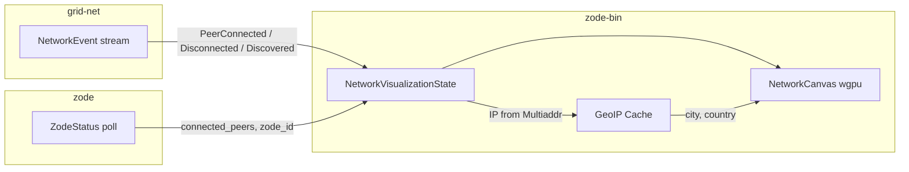
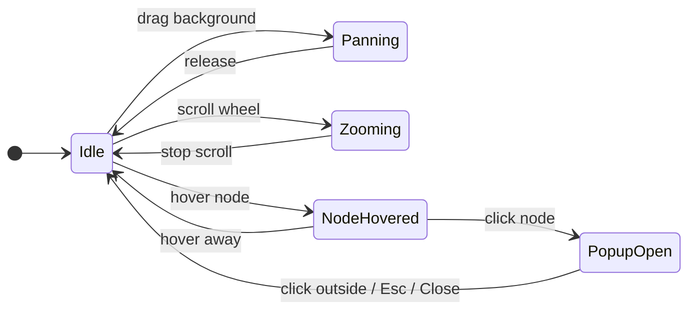

# The Grid v0.1.0 — Network Visualization (Zode App)

## Purpose

The **Network Visualization** panel provides a GPU-accelerated, real-time graph of the local Zode and all connected / discovered Zodes. It is rendered inside the **ZODE** tab of `zode-bin`, positioned **above** the existing Node section, giving the operator an immediate spatial overview of their node's place in the network.

## Requirements

### Must

| # | Requirement |
|---|-------------|
| V-1 | Display the local Zode and every connected peer as nodes in a force-directed graph rendered on a GPU-accelerated canvas (egui `PaintCallback` with `wgpu`). |
| V-2 | The local Zode node MUST be visually distinct (e.g. larger radius, accent color, central label "YOU") so the operator can instantly identify it. |
| V-3 | Edges connect the local Zode to each connected peer. Edge presence tracks live connectivity — edges appear on `PeerConnected` and disappear on `PeerDisconnected`. |
| V-4 | Clicking (or tapping) a node MUST open a popup overlay displaying: **Zode ID**, **IP address** (resolved from the peer's observed multiaddr), and **location** (city / country, resolved via GeoIP lookup). |
| V-5 | The popup MUST be dismissable by clicking outside it, pressing Escape, or clicking a close button. |
| V-6 | The visualization MUST update in real time as peers connect and disconnect, without requiring a manual refresh. |
| V-7 | The canvas MUST support pan (click-drag on background) and zoom (scroll wheel) so operators of large networks can navigate the graph. |

### Should

| # | Requirement |
|---|-------------|
| V-8 | Discovered-but-not-yet-connected peers (from `PeerDiscovered` events) SHOULD be rendered as faded / dashed nodes to distinguish them from fully connected peers. |
| V-9 | Node positions SHOULD be computed by a force-directed layout (repulsion between all nodes, attraction along edges) running each frame. The layout stabilises quickly for small peer counts (< 50) and remains interactive for up to ~200 nodes. |
| V-10 | The visualization panel SHOULD be collapsible so the operator can hide it when not needed, reclaiming vertical space for the Node / Storage / Metrics sections. |
| V-11 | On hover (before click), a node SHOULD highlight and show a minimal tooltip with the short Zode ID (`Zx` prefix + first 16 chars). |

### May

| # | Requirement |
|---|-------------|
| V-12 | Animate edge pulses when traffic (store/fetch) flows between the local Zode and a peer. |
| V-13 | Color-code nodes by shared topic subscriptions (e.g. peers sharing the same program topics get a shared tint). |
| V-14 | Support a "fit all" button that resets zoom/pan to show the entire graph. |

## Data sources

The visualization consumes data already exposed by `zode`:

| Data | Source | Update trigger |
|------|--------|----------------|
| Local Zode ID | `ZodeStatus.zode_id` | Status poll (500 ms) |
| Connected peers | `ZodeStatus.connected_peers` | Status poll |
| Peer connect/disconnect | `NetworkEvent::PeerConnected` / `PeerDisconnected` via `Zode::subscribe_events` | Real-time broadcast |
| Discovered peers | `NetworkEvent::PeerDiscovered { zode_id, addresses }` | Real-time broadcast |
| Peer addresses | `addresses` field in `PeerDiscovered`; observed addresses from libp2p identify | Event payload |

### Reactive graph updates

The graph MUST be **event-driven**, not poll-driven. The primary source of truth for node add/remove is the `NetworkEvent` stream from `Zode::subscribe_events`:

1. **`PeerConnected(zode_id)`** — Immediately add a `GraphNode` (if not already present) and an edge from the local node to the new peer. Trigger a GeoIP lookup for the peer's address. The force layout begins positioning the new node on the next tick.
2. **`PeerDisconnected(zode_id)`** — Immediately remove the edge. If the peer was also discovered via DHT (`PeerDiscovered`), demote the node to discovered-only (faded). Otherwise remove the node entirely. If the removed node was the currently selected popup target, dismiss the popup.
3. **`PeerDiscovered { zode_id, addresses }`** — Add or update the node as discovered-only (faded/dashed). Store the addresses for GeoIP resolution. If the peer later connects, promote to fully connected.

The 500 ms `ZodeStatus` poll serves as a **consistency reconciliation** pass: on each poll the graph is diffed against `ZodeStatus.connected_peers` to catch any events that were missed (e.g. due to broadcast lag). Nodes present in the graph but absent from the status are removed; peers present in the status but absent from the graph are added. This guarantees the graph never drifts from the true peer set, even if individual events are lost.

The net effect: the graph updates within **one frame** (~16 ms at 60 fps) of a connect/disconnect event, with a worst-case consistency guarantee of 500 ms via the reconciliation poll.

### GeoIP resolution

IP-to-location mapping is performed **locally** using an embedded GeoIP database (e.g. MaxMind GeoLite2-City `mmdb`). No external API calls are made at runtime.

| Field | Source |
|-------|--------|
| IP address | Extracted from the peer's observed `Multiaddr` (first `/ip4` or `/ip6` component). |
| City / Country | Looked up from the embedded GeoIP database. Falls back to "Unknown" if the IP is private, loopback, or not in the database. |

The GeoIP database file is bundled as a build-time asset (e.g. `include_bytes!`) or loaded from a configurable path in the data directory. The lookup runs on a background thread to avoid blocking the UI.

## UI layout

Within the **ZODE** tab, the vertical order becomes:

```
┌───────────────────────────────────────┐
│  Network Visualization (collapsible)  │  ← NEW
│  ┌─────────────────────────────────┐  │
│  │   [canvas: force-directed graph]│  │
│  │       ○ ── ● YOU ── ○          │  │
│  │            │                    │  │
│  │            ○                    │  │
│  └─────────────────────────────────┘  │
├───────────────────────────────────────┤
│  Node (ZODE ID, ADDRESS, PEERS, …)    │  ← existing
├───────────────────────────────────────┤
│  Storage (DB SIZE, BLOCKS, …)         │  ← existing
├───────────────────────────────────────┤
│  Metrics (BLOCKS STORED, REJECTIONS)  │  ← existing
└───────────────────────────────────────┘
```

Default canvas height: **250 px**, resizable by dragging the bottom edge. When collapsed, only a thin header bar ("Network ▸ 5 peers") is shown.

### Popup overlay

When a node is clicked, a floating panel appears anchored near the clicked node:

```
┌──────────────────────────┐
│  ZODE ID   Zx12ab34cd…ef │  [Copy]
│  IP        203.0.113.42  │
│  LOCATION  Berlin, DE    │
│                    [Close]│
└──────────────────────────┘
```

Fields that cannot be resolved display "Unknown". The popup disappears on click-outside, Escape, or the Close button.

## Rendering approach

### GPU acceleration via egui + wgpu

`zode-bin` already runs on `eframe` which uses `wgpu` as its rendering backend. The visualization uses egui's `PaintCallback` to issue custom wgpu draw calls inside the allocated UI rect:

```rust
pub struct NetworkCanvas {
    /// Current graph state: nodes, edges, positions, velocities.
    graph: NetworkGraph,
    /// Camera: pan offset + zoom level.
    camera: Camera,
    /// Currently selected node (shown in popup).
    selected_node: Option<ZodeId>,
    /// Whether the section is collapsed.
    collapsed: bool,
}

pub struct NetworkGraph {
    pub nodes: Vec<GraphNode>,
    pub edges: Vec<(usize, usize)>,
}

pub struct GraphNode {
    pub zode_id: String,
    pub position: [f32; 2],
    pub velocity: [f32; 2],
    pub is_local: bool,
    pub connected: bool,
    pub ip_addr: Option<String>,
    pub location: Option<String>,
}

pub struct Camera {
    pub offset: [f32; 2],
    pub zoom: f32,
}
```

### Force-directed layout

Each frame (or at a fixed 60 Hz tick decoupled from repaint rate):

1. **Repulsion:** Every node pair applies a Coulomb-like repulsive force inversely proportional to distance squared.
2. **Attraction:** Each edge applies a Hooke-like spring force pulling connected nodes together.
3. **Centering:** A gentle drift pulls the centroid toward the canvas center.
4. **Damping:** Velocities are multiplied by a damping factor (e.g. 0.9) each tick to reach equilibrium.
5. **Integration:** `position += velocity * dt`.

For small networks (< 50 nodes) this runs comfortably on the CPU each frame. For larger networks the force computation can be offloaded to a compute shader (wgpu compute pass) — but this is a **may** optimisation, not required for v0.1.0.

### Draw pipeline

| Pass | What |
|------|------|
| Edges | Thin lines (1–2 px) from source to target, anti-aliased. Dashed for discovered-only peers. |
| Nodes | Filled circles. Local node: 12 px radius, accent color. Remote connected: 8 px radius, white. Discovered-only: 6 px radius, 40% opacity. |
| Labels | Short Zode ID (`Zx` prefix + first 8 chars) rendered below each node at small font size. Hidden when zoom is low to avoid clutter. |
| Popup | Standard egui `Window` anchored to screen-space position of the selected node. |

## Structs

### NetworkVisualizationState

Held inside `ZodeApp` (or a sub-struct of it):

```rust
pub struct NetworkVisualizationState {
    pub canvas: NetworkCanvas,
    pub geo_cache: HashMap<String, GeoResult>,
    pub show_discovered: bool,
}

pub struct GeoResult {
    pub ip: String,
    pub city: Option<String>,
    pub country: Option<String>,
}
```

`geo_cache` maps Zode ID (`Zx`-prefixed string) → resolved GeoIP result so lookups are performed only once per peer.

## Impact on existing code

### zode-bin

| File | Change |
|------|--------|
| `state.rs` | Add `NetworkVisualizationState` to `AppState` and `StateSnapshot`. |
| `app.rs` | Initialize `NetworkVisualizationState`. Update graph from `ZodeStatus` and `NetworkEvent` stream. |
| `render.rs` | In `render_status`, call `render_network_visualization` **before** the existing `render_node_status`. |
| new: `visualization.rs` | Contains `NetworkCanvas`, force layout, wgpu paint callback, popup rendering, pan/zoom input handling. |
| `Cargo.toml` | Add optional dependency on a GeoIP reader crate (e.g. `maxminddb`). |

### zode

No changes required. The visualization consumes `ZodeStatus` and `NetworkEvent` which are already public.

### grid-net

No changes required for v0.1.0. Future work (V-12, V-13) may need additional event data (traffic counters per peer, topic lists per peer).

## Diagram

### Data flow



### Interaction state machine



## Testing

| Test | Description |
|------|-------------|
| Graph sync | Start Zode, connect 3 peers. Verify `NetworkGraph.nodes` contains 4 entries (local + 3 peers) and 3 edges. |
| Disconnect removal | Disconnect a peer. Verify the node is removed (or faded if discovered-only) and the edge is removed within one poll cycle. |
| Popup content | Click a node. Verify popup displays the correct Zode ID and IP. |
| GeoIP fallback | Feed a private IP (e.g. `127.0.0.1`). Verify location shows "Unknown". |
| Pan and zoom | Programmatically set camera offset and zoom. Verify node screen-space positions transform correctly. |
| Layout convergence | Place 10 nodes at random positions, run 200 layout ticks. Verify total kinetic energy decreases below a threshold (layout stabilised). |
| Collapse toggle | Collapse the visualization. Verify the canvas is not rendered and the section header shows peer count summary. |

## Implementation

- **Crate:** `zode-bin`. New module `visualization.rs`.
- **GPU backend:** Uses the existing `eframe` / `wgpu` pipeline via `egui::PaintCallback`. No additional GPU framework needed.
- **GeoIP:** Optional dependency `maxminddb` for reading `.mmdb` files. The GeoLite2-City database is not shipped in the repo; the operator places it in the data directory or the build bundles it. If absent, location fields show "Unknown".
- **Performance budget:** Layout + draw must complete in < 2 ms per frame for 50 nodes to maintain 60 fps alongside the rest of the UI.
